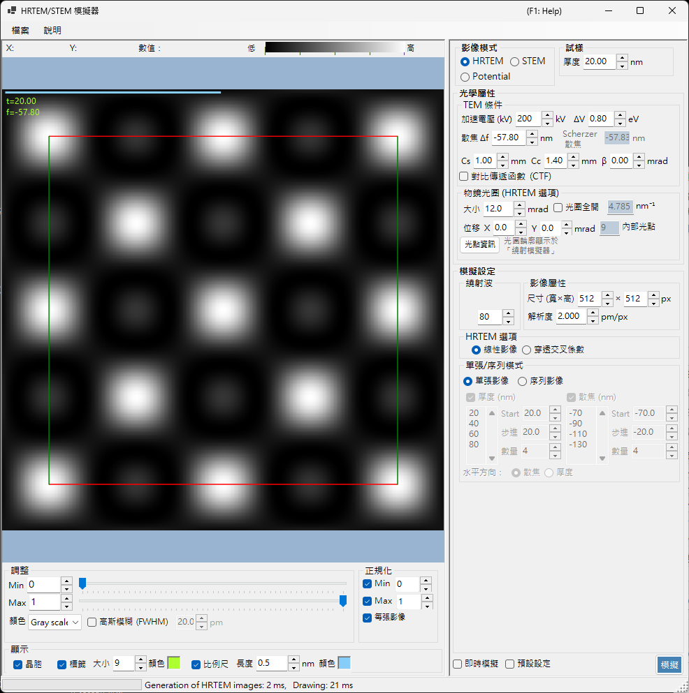
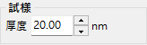
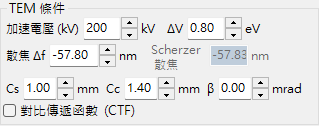
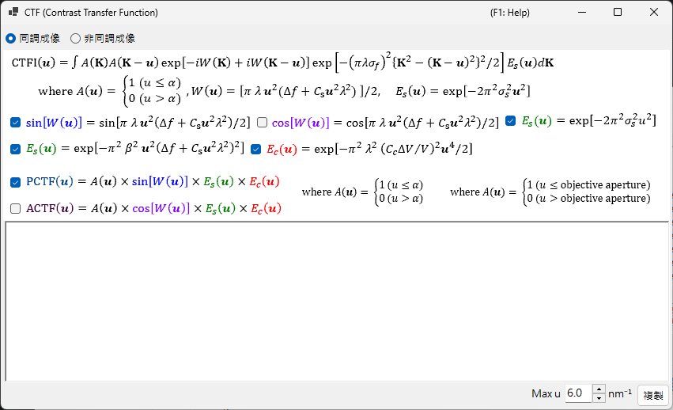
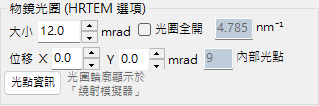
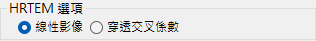
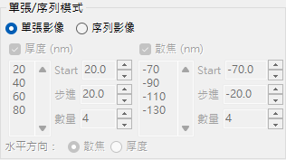
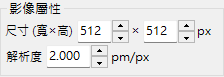
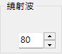

# HRTEM 模擬

**HRTEM（高解析穿透式電子顯微鏡）** 模擬用於計算高解析 TEM 晶格條紋影像。這是 [HRTEM/STEM 模擬器](index.md) 的主要模式。

> 本頁涵蓋 **影像模式 = HRTEM** 時右側出現的所有設定。左側的控制項——結果的顯示與亮度調整——請參閱[總覽頁](index.md#display-settings)。

---

## 概觀

穿透試樣的電子波在物鏡像差的影響下成像，即形成 HRTEM 影像。ReciPro 以布洛赫波法（動力學計算）計算電子波在試樣內部的傳播，並透過相位對比轉移函式 (PCTF) 產生 HRTEM 影像。

### 計算流程

1. **布洛赫波法**：計算電子波在晶體位能中的傳播，求得出射波的振幅與相位
2. **透鏡函式**：套用物鏡像差（球面像差 $C_s$、散焦 $\Delta f$）
3. **部分同調**：考量有限的光源尺寸（空間同調）與能量起伏（時間同調）
4. **成像**：計算強度分布 $|\psi(\mathbf{r})|^2$

理論請參閱[附錄 A3.2 — HRTEM 成像](../appendix/a3-bloch-wave/hrtem.md)。

---

## 試樣

- **厚度** ：試樣厚度 (nm)。HRTEM 影像強烈依賴於厚度。在 **序列影像** 模式下此值會被忽略，改用下述的厚度清單。

---

## TEM 條件

設定物鏡的成像條件。

| 參數 | 說明 | 預設 / 典型值 |
|-----------|-------------|-------------------|
| **加速電壓 (kV)** | 加速電壓。經相對論修正的電子波長顯示於右側 | 200 kV |
| **散焦 Δf** | 物鏡的散焦 (nm)。下方顯示參考用的 **Scherzer 散焦** 值 | −57.8 nm |
| **Cs** | 球面像差係數 (mm)。影響 CTF 與 Scherzer 散焦 | 0.5–1.0（傳統）、< 0.01（Cs 校正） |
| **Cc** | 色像差係數 (mm)。決定能量擴展所造成的影像模糊 | 1.0–2.0 mm |
| **β** | 照明半角 (mrad)。代表有限光源尺寸效應（空間同調） | 0.1–1.0 mrad |
| **ΔV** | 電子能量擴展的半高全寬 (eV)。與 Cc 共同決定色像差造成的焦點擴展 | 0.5–2.0 eV |

> **右鍵選單**：在 TEM 條件面板上，可一鍵套用 **將所有像差設為零** / **將散焦設為 Scherzer 值** / **將散焦設為 0 nm**。條件預設組（300kV ARM300F、200kV 2100F 等）可從左下方的 **預設設定** 叫用。

### Scherzer 散焦

在此散焦值附近相位對比最佳；由目前的波長與球面像差 $C_s$ 計算而得（僅供參考）。

$$\Delta f_{\text{Scherzer}} = -\sqrt{\tfrac{4}{3}\,C_s \lambda}\quad\left(\approx -1.155\,\sqrt{C_s \lambda}\right)$$

在此條件下，PCTF 在寬廣的空間頻率範圍內為負值，因此原子位置呈現暗對比。ReciPro 採用此原始 Scherzer 值（透過將像差相位 $\chi$ 的最小值設為 $-2\pi/3$ 推導而得），GUI 中顯示的值即遵循此公式。請注意，部分文獻改用 *延伸 Scherzer* 值 $-1.2\sqrt{C_s\lambda}$，可使傳遞頻帶更寬。

---

## 透鏡函式 / 對比傳遞函數 (CTF)

勾選 **對比傳遞函數 (CTF)** 會開啟一個視窗，繪出透鏡像差與散焦在各空間頻率下如何傳遞影像對比。

- $\sin\chi(u)$ ：相位對比轉移函式（$\chi(u)$ 為透鏡的像差函式）
- $E_\text{s}(u)$ ：空間同調包絡函式；有限光源尺寸 ($\beta$) 所造成的衰減
- $E_\text{c}(u)$ ：時間同調包絡函式；能量起伏 ($C_c$, $\Delta V$) 所造成的衰減

變更橫軸 $u$（空間頻率）的上限，即可改變繪圖範圍。

---

## 物鏡光圈 (HRTEM 選項)

限制通過物鏡光圈的繞射波。被光圈截去的繞射波數量，也會改變納入布洛赫波計算的繞射點數量（上限為 **繞射波** 中設定的最大布洛赫波數）。

- **大小** ：物鏡光圈的半角 (mrad)。值越小，被截去的高角度繞射波越多，高解析細節也越平滑。同時顯示對應的倒易空間半徑 $\sin\theta/\lambda$ (nm⁻¹)。
- **位移 X** / **Y** ：物鏡光圈中心的位移 (mrad)。用於暗場成像與傾斜成像。
- **光圈全開** ：將物鏡光圈全開（無限大），使所有繞射波皆參與成像。
- **內部光點** ：落在光圈內的繞射束（光點）數量（唯讀）。
- **光點資訊** ：開啟一個表格，列出光圈內的繞射束（強度、複數振幅等）。

> 物鏡光圈的大小也會顯示於 **繞射模擬器** 中。

---

## HRTEM 選項（部分同調模型）

選擇在整合所有入射束方向的貢獻時所用的干涉模型。

- **線性影像** ：計算成本低。適用於弱相位物體近似成立的薄試樣；將 PCTF 乘上空間與時間同調包絡。
- **穿透交叉係數** ：計算成本高但較準確。對完整的穿透交叉係數進行積分，適用於會激發許多強繞射波的強散射體。

詳情請參閱[附錄 A3.2 — HRTEM 成像](../appendix/a3-bloch-wave/hrtem.md)。

---

## 單張/序列模式

- **單張影像** ：在目前的厚度與散焦下計算一張 HRTEM 影像。
- **序列影像** ：逐步改變厚度與散焦，產生一組影像（厚度序列／焦點序列）。可用於尋找與實驗影像最吻合的條件。

序列影像需設定下列項目。

| 項目 | 說明 |
|------|-------------|
| **厚度 (nm)** / **散焦 (nm)** | 要掃描的量（兩者可同時勾選） |
| **Start / 步進 / 數量** | 起始值、步進寬度與影像張數。這些值會展開至下方的清單框，清單框也可直接編輯 |
| **水平方向：** | 同時掃描厚度與散焦時，沿格狀排列水平方向配置的量（**散焦** 或 **厚度**） |

同時掃描厚度與散焦時，會產生列 × 行的影像矩陣。

---

## 影像屬性

- **尺寸 (寬×高)** ：模擬影像的像素數（預設為 512×512）。
- **解析度** ：取樣解析度 (pm/px)。值越小可解析越細的晶格條紋，但 FFT 時間也會成比例增加。

---

## 繞射波

- Bethe 法（動力學計算）所用布洛赫波的最大數量，預設為 80。數量越多準確度越高，但本徵值問題的求解時間為 $O(N^3)$。

---

## 另請參閱

- [HRTEM/STEM 模擬器（概觀）](index.md)
- [STEM 模擬](2-stem-simulation.md)
- [位能模擬](3-potential-simulation.md)
- [附錄 A3.2 — HRTEM 成像](../appendix/a3-bloch-wave/hrtem.md)
