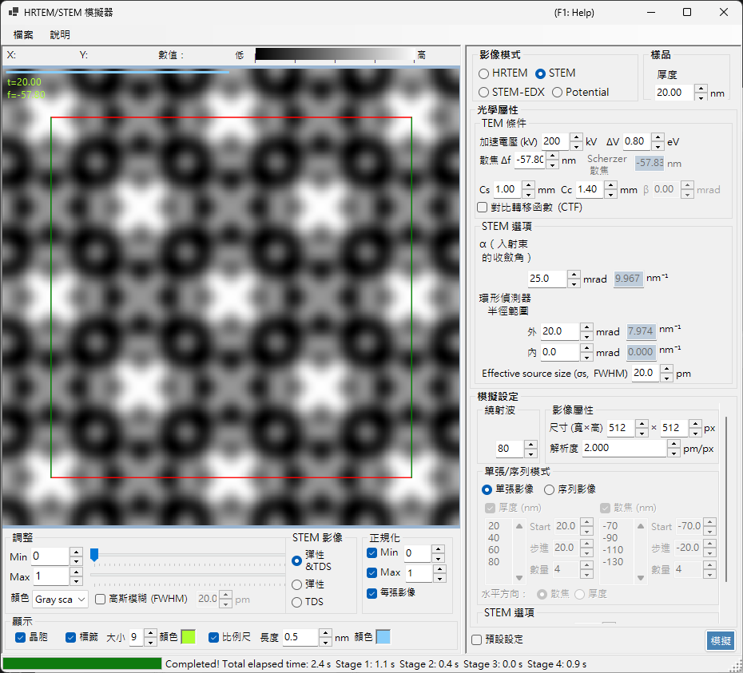

# STEM 模擬

**STEM (Scanning Transmission Electron Microscopy) 模擬**使用布洛赫波法計算掃描穿透式電子顯微鏡影像。

> 本頁列出當 **Image mode = STEM** 時於右側出現的所有設定。關於左側的結果顯示、亮度與正規化控制項，請參閱[總覽頁](index.md)。下方僅重複說明 STEM 專屬的**顯示目標**。

---

## 總覽

會聚電子束在試樣上掃描，於每個掃描位置由環形偵測器收集穿透與散射的電子。ReciPro 以布洛赫波法（動力學計算）計算 STEM 影像。

### 計算流程

1. 在每個掃描位置，以布洛赫波法針對會聚探針的每個入射方向計算繞射強度。
2. 將散射強度在偵測器的角度範圍上積分。
3. 可同時計算彈性與熱漫散射 (TDS) 的貢獻。

理論請參閱 [Appendix A3.4 — STEM calculation](../appendix/a3-bloch-wave/stem.md)。

---

## 偵測器類型

| 偵測器 | 角度範圍 | 主要貢獻 | 對比 |
|----------|-------------|-------------------|----------|
| **BF**（明場） | 0 – 會聚角 | 彈性 | 相位對比 |
| **ABF**（環形明場） | 會聚角的內側部分 | 彈性 | 對輕元素敏感 |
| **LAADF**（小角環形暗場） | 略在會聚角外側 | 彈性 + TDS | 對應變敏感 |
| **HAADF**（大角環形暗場） | 遠在會聚角外側 | TDS（非彈性） | Z 對比（$\propto Z^2$） |

> **典型偵測器設定**（每一項皆可從 STEM 選項的右鍵選單一鍵設定，全部使用會聚角 α = 25 mrad）：
> BF (0–5 mrad) / ABF (12–24 mrad) / LAADF (26–60 mrad) / HAADF (80–250 mrad)

---

## 試樣參數

- **Thickness** : 試樣厚度 (nm)。在 **Serial image** 模式下此值會被忽略。

---

## TEM 條件

| 參數 | 說明 | 預設 / 典型 |
|-----------|-------------|-------------------|
| **Acc. Vol. (kV)** | 加速電壓。經相對論修正的電子波長會顯示於旁邊 | 200 kV |
| **Defocus Δf** | 物鏡（探針成形透鏡）的欠焦 (nm) | −57.8 nm |
| **Cs** | 球面像差係數 (mm)。影響探針尺寸 | 0.5–1.0 mm |
| **Cc** | 色像差係數 (mm) | 1.0–2.0 mm |
| **ΔV (FWHM)** | 電子能量分布的半高全寬 (eV) | 0.5–2.0 eV |

> **β（照明半角）在 STEM 模式下停用**，因為會聚角 α 取代了它的角色。

---

## STEM 選項（光學）

設定會聚探針與環形偵測器的幾何。每個角度於右側也會換算為倒易空間半徑 $\sin\theta/\lambda$ (nm⁻¹) 顯示。

| 參數 | 說明 | 預設 / 典型 |
|-----------|-------------|-------------------|
| **α (convergence angle)** | 會聚探針的半角 (mrad)。較大的值會產生較細的探針並改變繞射對比 | 15–25 mrad |
| **(Annular) detector inner angle** | 環形偵測器的內側收集半角 (mrad)。此角度以內的訊號會被排除 | BF: 0, HAADF: 80 |
| **(Annular) detector outer angle** | 環形偵測器的外側收集半角 (mrad)。此角度以外的訊號會被排除 | BF: 5, HAADF: 250 |
| **Effective source size σs (FWHM)** | 有效電子源尺寸。較大的值會使探針模糊並降低細節對比 | — |

---

## STEM 選項（模擬）

- **Slice thickness for inelastic** : 計算 TDS（熱漫、非彈性）強度時所用的試樣切片厚度 (nm)。較小的值較準確但較慢。
- **Angular resolution** : 入射探針方向的角度取樣解析度 (mrad)。較小的值對探針取樣較細但較慢。

---

## 影像模式（single / serial）

- **Single image** : 在目前厚度計算一張 STEM 影像。
- **Serial image** : 產生一系列影像，厚度 / 欠焦會分階段遞變（以 **Start / Step / Num** 設定；下方的清單也可直接編輯）。

---

## 影像內容

- **Size (W×H)** : 掃描影像的像素數（預設 512×512）。在 STEM 中此值等於掃描點數，並使計算時間線性增加。
- **Resolution** : 取樣解析度 (pm/px)。

---

## 繞射波

- **Max Bloch waves** : Bethe 法所用布洛赫波的最大數目（預設 80）。本徵值問題的計算成本隨波數的立方增加。

---

## STEM 顯示目標（結果側）

視窗左下角的顯示切換可選擇顯示已計算 STEM 影像中的哪個散射分量（可在不重新計算的情況下切換）。

| 顯示目標 | 說明 |
|----------------|-------------|
| **Elastic** | 僅彈性散射的影像 |
| **TDS** | 僅熱漫散射的影像 |
| **Elastic & TDS** | 彈性 + TDS 的總和 |

---

## 計算成本

STEM 模擬的計算成本很高，因此請適當設定下列參數。

| 因素 | 影響 |
|--------|--------|
| **會聚角** | 較大 → CBED 盤重疊較多 → 成本較高 |
| **布洛赫波** | 本徵值問題的成本隨 N³ 增加 |
| **角度解析度** | 較細 → 較準確，但成本隨 N² 增加 |
| **影像像素 (Size)** | 隨掃描點數線性增加 |

---

## 溫度因子的重要性

對於 HAADF-STEM 模擬，原子必須具有非零的等向性溫度因子（德拜-沃勒因子）。若該值未知，請設定 $B \approx 0.5\ \text{Å}^2$。若溫度因子為零，TDS 強度即為零，HAADF 影像便無法正確計算。

| 偵測器 | 範圍 | 主要貢獻 |
|----------|-------|-------------------|
| BF, ABF | 會聚角以內 | 彈性 |
| LAADF, HAADF | 會聚角以外 | 非彈性 (TDS) |

---

## 與 Dr. Probe 的比較

已確認 ReciPro 的 STEM 模擬與廣為使用的 Dr. Probe GUI (v1.10) 高度吻合。下圖針對 BF、ABF、LAADF 與 HAADF 偵測器，在一系列厚度（2.96–60.05 nm）下比較兩者，包含無像差（左）以及 Cs = 0.2 mm、欠焦 = −25.9 nm（右）兩種情況。兩套程式在所有偵測器類型與厚度上皆一致。

更詳細的報告以 PDF 形式提供：[Comparison of STEM simulations by Dr. Probe GUI (v1.10) and ReciPro (v4.854)](https://github.com/seto77/ReciPro/files/10976084/ComparisonSTEMsimulations.pdf)。

---

## 另請參閱

- [HRTEM/STEM 模擬器（總覽）](index.md)
- [HRTEM 模擬](1-hrtem-simulation.md)
- [位能模擬](3-potential-simulation.md)
- [Appendix A3.4 — STEM calculation](../appendix/a3-bloch-wave/stem.md)
- [Appendix A3.4 — STEM calculation](../appendix/a3-bloch-wave/stem.md)
