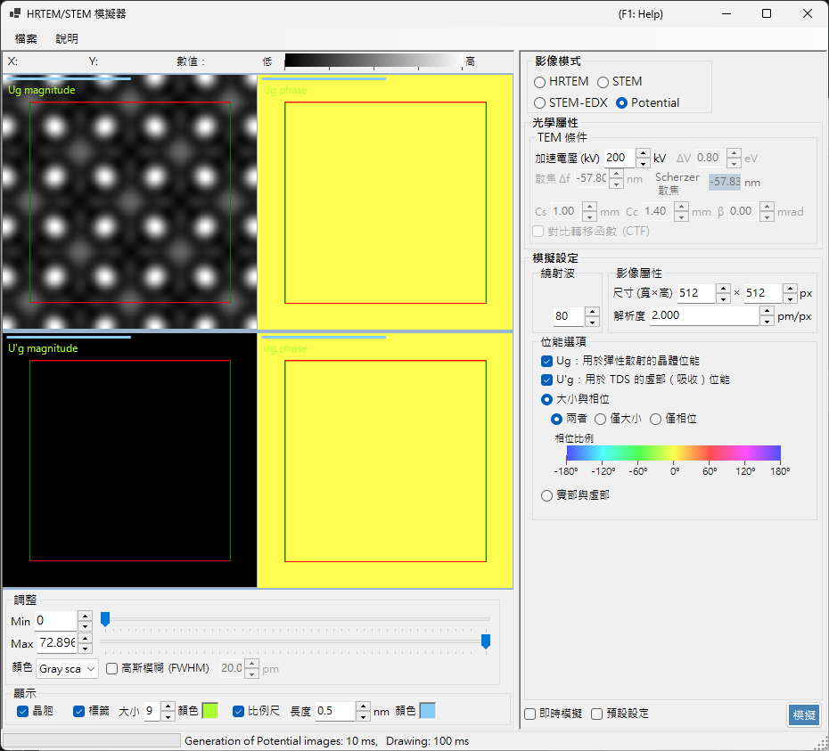

# 位能模擬

**位能模擬**會計算並顯示晶體位能的二維分布。其中不套用任何影像傳遞效果（透鏡像差、偵測器）：它將投影後的晶體位能本身視覺化。

> 本頁說明當 **Image mode = Potential** 時，右側出現的所有設定。關於結果顯示、亮度調整及左側的其他控制項，請參閱[總覽頁面](index.md#display-settings)。

---

## 總覽

晶體內部的電子會被晶體位能散射。其分布是所有繞射與成像現象的基礎，也是理解晶體結構的關鍵資訊。由於此模式既不包含透鏡像差，也不包含與厚度相關的動力學效應，因此非常適合用來檢視結構本身。

> **在位能模式下，試樣厚度、強度正規化以及影像模式（single / serial）面板不會顯示。** 在 TEM 條件中，只有加速電壓是作用中的。

---

## TEM 條件

- **Acc. voltage (kV)** — 加速電壓。它決定電子波長，並用於計算位能的傅立葉係數 $U_g$。

> **Defocus、Cs、Cc、β、ΔE 與 PCTF 在位能模式下為非作用狀態**（不套用任何成像光學），並顯示為灰色。

---

## 位能選項

選擇要顯示哪一種位能以及如何顯示。

### 目標位能

| 類型 | 說明 |
|------|-------------|
| **$U_g$ — 彈性散射位能** | 負責彈性散射的（靜電）晶體位能。代表散射強度 |
| **$U'_g$ — 吸收位能** | 由熱漫散射（TDS）產生的虛部（吸收）位能。代表彈性通道的損失 |

$U_g$ 與 $U'_g$ 可同時顯示（每勾選一個就會增加一個顯示窗格）。

### 顯示方法

| 模式 | 選項 |
|------|---------|
| **大小與相位** | **兩者** / **僅大小** / **僅相位**（相位以色環呈現，下方並顯示相位刻度） |
| **實部與虛部** | **兩者** / **僅實部** / **僅虛部** |

---

## 影像屬性

- **Size (W×H)** — 產生影像的像素尺寸（預設 512×512）。
- **Resolution** — 取樣解析度（pm/px）。

---

## 繞射波

- **Max Bloch waves** — 納入位能傅立葉合成中的布洛赫波（傅立葉係數）的最大數目（預設 80）。數值越大，納入的空間頻率越高，並能重現位能更細緻的細節。

---

## 影像調整（左側）

亮度（Min / Max）、色階及晶胞點陣疊加是在左側的 **Adjust** 與 **Display** 中設定（請參閱[總覽頁面](index.md#display-settings)）。

---

## 另請參閱

- [HRTEM/STEM 模擬器（總覽）](index.md)
- [HRTEM 模擬](1-hrtem-simulation.md)
- [STEM 模擬](2-stem-simulation.md)
