# HRTEM / STEM Simulator

**HRTEM/STEM 模擬器**可模擬 TEM 晶格條紋影像 (HRTEM)、STEM 影像以及投影位能。點按 **Simulate** 即可執行計算。

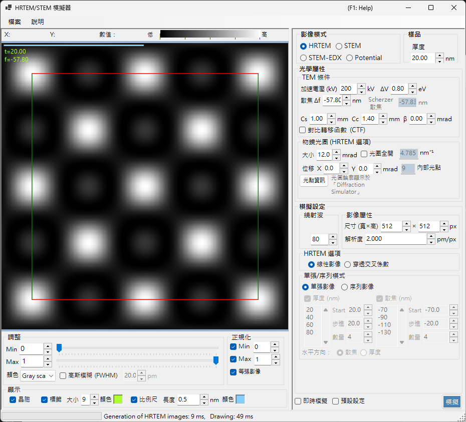

---

## 鍵盤與滑鼠快速鍵

結果會以一個或多個影像窗格顯示。它們採用 ReciPro 的標準[影像檢視導覽](../21-shortcuts.md)，且所有窗格會一起平移與縮放。

| 快速鍵 | 動作 |
|----------|--------|
| <kbd>F1</kbd> | 開啟線上手冊的本頁 |
| <kbd>CTRL</kbd>+<kbd>C</kbd> (聚焦於影像網格時) | 將影像以中繼檔 (metafile) 複製到剪貼簿 |
| 左鍵拖曳 / 中鍵拖曳 | 平移影像 (所有窗格一起移動) |
| 滑鼠滾輪向上 / 向下 | 在游標處放大 (×2) / 縮小 (×0.5) |
| 以右鍵拖曳出方框 | 放大至所選區域 |
| 右鍵點按 / 右鍵雙擊 | 縮小 (×0.5) |
| <kbd>CTRL</kbd> + 以右鍵拖曳出方框 | 選取矩形區域 |
| 左鍵雙擊某窗格 | 將該窗格最大化 / 還原格線 (多窗格版面) |
| 移動滑鼠 (不按鍵) | 讀取游標處的位置 (pm) 與像素值 |

→ 請參閱 **[21. 鍵盤與滑鼠快速鍵](../21-shortcuts.md)**，一覽每個視窗的快速鍵。

---

## 依目標的快速路徑

| 目標 | 從何開始 | 參考 |
|------|------------|-----------|
| 計算單張 HRTEM 影像 | 將 **Image mode** 設為 **HRTEM**，然後在 **TEM conditions** 中設定加速電壓與欠焦 | [HRTEM 模擬](1-hrtem-simulation.md)、[HRTEM 成像](../appendix/a3-bloch-wave/hrtem.md) |
| 計算 STEM 影像 | 將 **Image mode** 設為 **STEM**，然後在 **STEM options** 中設定會聚角與偵測器 | [STEM 模擬](2-stem-simulation.md)、[STEM 計算](../appendix/a3-bloch-wave/stem.md) |
| 檢視投影位能 | 將 **Image mode** 設為 **Potential** | [位能模擬](3-potential-simulation.md) |
| 產生厚度 / 欠焦序列 | 在 **HRTEM options** 中設定 **Single / Serial** 與影像條件 | [HRTEM 模擬](1-hrtem-simulation.md) |
| 搭配 TDS 使用 HAADF-STEM | 將原子溫度因子設為非零值，並使用 LAADF / HAADF 偵測器 | [STEM 計算](../appendix/a3-bloch-wave/stem.md) |

---

## 基本工作流程

1. 在主視窗中選取晶體與方位，然後開啟此模擬器。
2. 在 **Image mode** 中選擇 HRTEM、STEM 或 Potential。
3. 在 **Optical property** 中設定加速電壓、欠焦、像差、光闌與 STEM 會聚設定。
4. 在 **Simulation property** 中設定厚度、影像尺寸、解析度、布洛赫波數量與部分同調模型。
5. 點按 **Simulate**，然後在 **Display settings** 中調整亮度、正規化、比例尺與標籤。

---

## 影像區

視窗的左半部顯示模擬影像。頂端的狀態列會回報游標位置 (**X:**、**Y:**) 與游標下方的影像 **Value:** (強度)，旁邊還有一個反映目前色階與亮度範圍的 **Low → High** 強度刻度。

---

## 檔案選單

### 說明選單

---

## Image mode / Sample

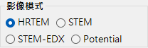{align=left}

HRTEM、Potential 或 STEM。

{ align=left style="clear: both" }
設定試樣厚度。

## Optical property { style="clear: both" }

### TEM conditions

加速電壓、欠焦 (顯示 Scherzer 值)。

#### Acc. voltage

電子顯微鏡的加速電壓。變更此值會更新經相對論修正的波長 (顯示於欄位旁)，並與 **Cs** 一起更新下方顯示的建議 **Scherzer defocus** 值。

#### Defocus

物鏡的欠焦值。Scherzer 欠焦 (在弱相位物體近似下使相位襯度傳遞最大化的值) 顯示於下方作為參考。

### Inherent property (HRTEM optical aberrations)

供透鏡函式計算使用的顯微鏡專屬像差參數。

- **Cs** — 球面像差係數。
- **Cc** — 色像差係數。
- **β** — 照明半角 (有限光源效應)。
- **ΔE** — 電子能量起伏的 1/e 寬度。

### Lens function

透鏡函式的圖。調整 *u* 的上限會改變繪圖範圍。

- **sin[χ(u)]** — 相位襯度傳遞函式 (PCTF)。
- **E_s(u)** — 空間同調包絡函式。
- **E_c(u)** — 時間同調包絡函式。

### Objective aperture (HRTEM option)

Cs、Cc、beta、delta-E、PCTF、空間/時間同調包絡、物鏡光闌。

#### Size

物鏡光闌大小，單位 mrad。勾選 **Open aperture** 可移除光闌。納入布洛赫波計算的繞射點數量取決於光闌；其上限由 **Simulation property** 中的 **Max Bloch waves** 值所限制。

#### Shift

光闌的水平位移，單位 mrad — 用於模擬 HRTEM 中偏移的物鏡光闌。

#### Spot info

開啟通過光闌的反射之詳細點清單 (強度、複數振幅等)。當同時開啟繞射模擬器以便比較時相當方便。

### STEM options (optical)

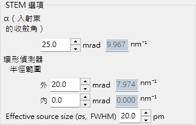

#### Convergence semi-angle

會聚探針的半角 (mrad)。控制 STEM 探針的大小與模擬影像的空間解析度。

#### Detector geometry

環形偵測器的內 / 外收集角 (mrad)。可在 BF (內角小)、ABF、LAADF、HAADF (內角大) 之間選擇。

#### Scan area / step

STEM 影像的掃描視野與像素大小。

---

## Simulation property

### HRTEM options

Max Bloch waves、影像像素/解析度、部分同調 (quasi-coherent / TCC)、Single/Serial 模式。

#### Max Bloch waves

動力學計算中所用布洛赫波的最大數量。增加此值可提升準確度，但代價是 *O*(*N*³) 的本徵值求解時間。

#### Image property (pixels & resolution)

模擬影像的像素尺寸與取樣解析度。較高的解析度可得到較細的條紋圖樣，但每個切片的 FFT 時間也會成比例增加。

#### Partial-coherent model

在合併來自所有入射束方向的貢獻時，如何處理波的干涉。

- **Quasi-coherent** — 快速的近似模型，將相位襯度傳遞函式乘上空間與時間同調包絡。
- **Transmission cross coefficient (TCC)** — 更準確的模型，對完整的穿透交叉係數進行積分。較慢，但在線性成像範圍內為精確值。

請參閱 [附錄 A3.2 — HRTEM 成像](../appendix/a3-bloch-wave/hrtem.md)。

#### Single / Serial mode

- **Single image** — 在 **Sample property** 設定的厚度與 **Optical property** 設定的欠焦下模擬單張影像。
- **Serial image** — 依各自的 **Start / Step / Num** 產生厚度 × 欠焦矩陣。可用於尋找與實驗影像最匹配的條件。

### STEM options (simulation)

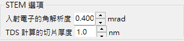

- **Bloch wave count** — 與 HRTEM 的作用相同，套用於每個探針位置。
- **Angular resolution** — 探針方向積分中的取樣點數。
- **TDS treatment** — 是否透過溫度因子 *B* 納入熱漫散射。使用 LAADF/HAADF 時為必要設定。

### Potential options

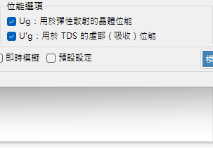

當 **Image mode = Potential** 時顯示。

- **Target potential** — 選擇 **U_g** (彈性) 或 **U′_g** (吸收 / TDS)。
- **Display method** — **Magnitude and phase**，或 **Real and imaginary part**。

### Image properties

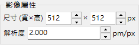

### Diffracted waves

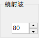

---

## Simulate

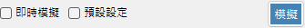

---

## Display settings

### Adjust

最小/最大亮度、色階、高斯模糊。

### Normalization

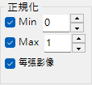

### Display

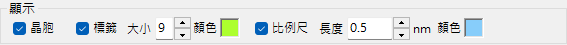

標籤 (厚度/欠焦)、比例尺、晶胞疊加。

### STEM image

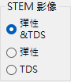

---

## STEM 模擬

計算取決於：會聚角、布洛赫波數量、角度解析度。

| 偵測器 | 貢獻 |
|----------|-------------|
| BF, ABF | 彈性 |
| LAADF, HAADF | 非彈性 (TDS) |

> 為了 TDS，請將溫度因子設為非零值 (不確定時可用 B = 0.5 Ų)。HAADF 強度 $\propto Z^2$。

更詳細的報告以 PDF 形式提供：[Dr. Probe GUI (v1.10) 與 ReciPro (v4.854) 之 STEM 模擬比較](https://github.com/seto77/ReciPro/files/10976084/ComparisonSTEMsimulations.pdf)。詳情請參閱 [STEM 模擬](2-stem-simulation.md)。

---

## 另請參閱

- [HRTEM 模擬](1-hrtem-simulation.md)
- [STEM 模擬](2-stem-simulation.md)
- [位能模擬](3-potential-simulation.md)
- [動力學繞射 (布洛赫波)](../appendix/a3-bloch-wave/index.md)
- [繞射模擬器](../7-diffraction-simulator/index.md)
- [電子軌跡](../8-electron-trajectory.md)
