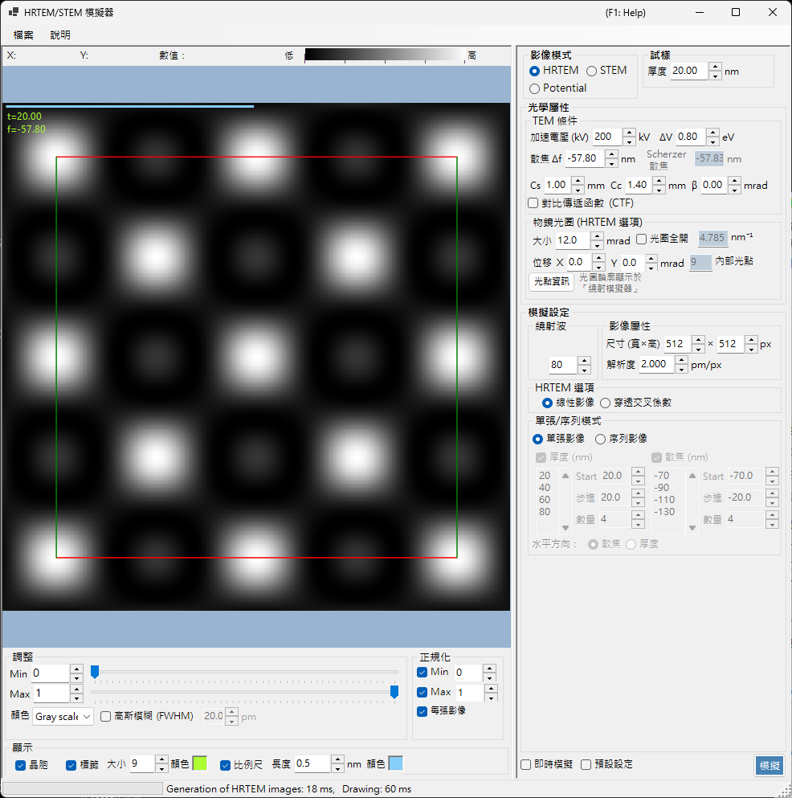
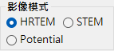
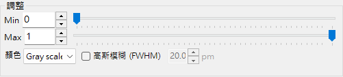
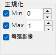
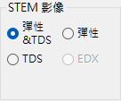
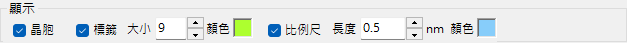
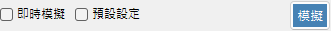
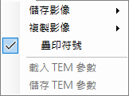
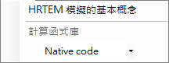

# HRTEM / STEM 模擬器

**HRTEM/STEM 模擬器**針對所選晶體與方位，模擬 TEM 晶格條紋影像 (HRTEM)、STEM 影像以及投影晶體位能。點按 **模擬** 即可執行計算。

視窗分為左右兩半。**左側**顯示模擬結果並控制其外觀（影像窗格、亮度、顏色、比例尺等）；**右側**則是計算條件（**光學屬性** 與 **模擬設定**）。

---

## 本頁與各模式頁面

- **本頁（總覽）**：所有模式共通的操作，以及**左側的結果顯示與調整控制項**。
- **各模式頁面**：該模式下**右側**出現的所有設定。每一頁皆可獨立閱讀（因此部分設定會在多個頁面中重複出現）。

| 模式 | 內容 | 頁面 |
|------|----------|------|
| **HRTEM** | 高解析 TEM 晶格條紋影像 | [HRTEM 模擬](1-hrtem-simulation.md) |
| **STEM** | 掃描穿透式電子顯微鏡影像 (BF / ABF / LAADF / HAADF) | [STEM 模擬](2-stem-simulation.md) |
| **Potential** | 投影晶體位能 ($U_g$ / $U'_g$) | [位能模擬](3-potential-simulation.md) |

---

## 鍵盤與滑鼠快速鍵

結果會以一個或多個影像窗格顯示。它們採用 ReciPro 的標準[影像檢視導覽](../21-shortcuts.md)，且所有窗格會一起平移與縮放。

| 快速鍵 | 動作 |
|----------|--------|
| <kbd>F1</kbd> | 開啟線上手冊的本頁 |
| <kbd>CTRL</kbd>+<kbd>C</kbd> (聚焦於影像網格時) | 將影像以中繼檔 (metafile) 複製到剪貼簿 |
| 左鍵拖曳 / 中鍵拖曳 | 平移影像 (所有窗格一起移動) |
| 滑鼠滾輪向上 / 向下 | 在游標處放大 (×2) / 縮小 (×0.5) |
| 以右鍵拖曳出方框 | 放大至所選區域 |
| 右鍵點按 / 右鍵雙擊 | 縮小 (×0.5) |
| <kbd>CTRL</kbd> + 以右鍵拖曳出方框 | 選取矩形區域 |
| 左鍵雙擊某窗格 | 將該窗格最大化 / 還原格線 (多窗格版面) |
| 移動滑鼠 (不按鍵) | 讀取游標處的位置 (pm) 與像素值 |

→ 請參閱 **[21. 鍵盤與滑鼠快速鍵](../21-shortcuts.md)**，一覽每個視窗的快速鍵。

---

## 依目標的快速路徑

| 目標 | 從何開始 | 參考 |
|------|------------|-----------|
| 計算單張 HRTEM 影像 | 將 **影像模式** 設為 **HRTEM**，然後在 **TEM 條件** 中設定加速電壓與散焦 | [HRTEM 模擬](1-hrtem-simulation.md)、[HRTEM 成像](../appendix/a3-bloch-wave/hrtem.md) |
| 計算 STEM 影像 | 將 **影像模式** 設為 **STEM**，然後在 **STEM 選項** 中設定會聚角與偵測器 | [STEM 模擬](2-stem-simulation.md)、[STEM 計算](../appendix/a3-bloch-wave/stem.md) |
| 檢視投影位能 | 將 **影像模式** 設為 **Potential** | [位能模擬](3-potential-simulation.md) |
| 產生厚度 / 散焦序列 | 在 HRTEM 模式中設定 **單張/序列模式** 與影像條件 | [HRTEM 模擬](1-hrtem-simulation.md) |
| 搭配 TDS 使用 HAADF-STEM | 將原子溫度因子設為非零值，並將 STEM 偵測器移至 LAADF / HAADF | [STEM 計算](../appendix/a3-bloch-wave/stem.md) |

---

## 基本工作流程

1. 在主視窗中選取晶體與方位，然後開啟此視窗。
2. 在 **影像模式** 中選擇 HRTEM、STEM 或 Potential。
3. 在 **光學屬性** 中設定加速電壓、散焦、像差、光圈、STEM 會聚角等（請參閱各模式頁面）。
4. 在 **模擬設定** 中設定厚度、影像尺寸、解析度、布洛赫波數量、部分同調模型等（請參閱各模式頁面）。
5. 點按 **模擬**，然後視需要以左側的 **調整**、**正規化** 與 **顯示** 調整外觀。

---

## 選擇影像模式

{ align=left }

右上方的 **影像模式** 用於選擇計算種類。右側的面板（**光學屬性** 與 **模擬設定**）會隨所選模式而改變。

- **HRTEM** — 高解析 TEM 晶格條紋影像 → [HRTEM 模擬](1-hrtem-simulation.md)
- **STEM** — 掃描穿透式電子顯微鏡影像 → [STEM 模擬](2-stem-simulation.md)
- **Potential** — 投影晶體位能 → [位能模擬](3-potential-simulation.md)

---

## 影像區（左側）

視窗的左半部顯示模擬影像。頂端的狀態列會回報游標位置 (**X:**、**Y:**) 與游標下方的影像 **數值：** (強度)，旁邊還有一個反映目前色階與亮度範圍的 **低 → 高** 強度刻度。

產生多張影像時（序列影像，或位能的振幅／相位），影像會以格狀排列，且所有窗格會一起縮放與平移。

---

## 結果的顯示與調整（左側面板） {#display-settings}

左下方的面板用於調整結果的外觀——亮度、顏色、正規化與疊加顯示。這些設定適用於所有模式，且無須重新計算即可生效。

### 調整

- **Min** / **Max** ：顯示強度範圍的下限（黑）與上限（白）。以滑桿調整對比。
- **顏色** ：影像的色階——**Gray scale** 或 **Cold-Warm**（藍至紅）。
- **高斯模糊 (FWHM)** ：勾選時，以右側指定的半高全寬 (pm) 套用高斯模糊，近似有限的解析度（點擴散函數）。

### 正規化

- **每張影像** ：勾選時，各影像分別正規化（未勾選時，整個序列共用同一刻度）。
- **Min** / **Max** ：將正規化的下限／上限固定為右側指定的值，而非影像的最小值／最大值。

### STEM 影像

僅在 STEM 模式下顯示。選擇所計算 STEM 影像中要顯示的散射成分（**彈性**、**TDS** 或 **彈性 & TDS**）。由於此項為 STEM 專屬，[STEM 模擬](2-stem-simulation.md)頁面也有說明。

### 顯示

設定疊加於影像上的項目。

- **晶胞** ：疊加投影單位晶胞的輪廓，方便將影像對比與晶格相對照。
- **標籤** ：疊加厚度、散焦、指數等標籤。可指定 **大小**（字型大小）與 **顏色**。
- **比例尺** ：疊加比例尺。可指定 **長度** (nm) 與 **顏色**。

---

## 執行模擬

- **模擬** ：以目前的晶體、顯微鏡條件、厚度、散焦與顯示設定執行計算。
- **停止** ：中止執行中的計算（僅在計算期間顯示）。
- **即時模擬** ：勾選時，旋轉晶體會立即重新計算（STEM 模式下隱藏）。
- **預設設定** ：切換預設視窗的顯示，該視窗可儲存與叫用 TEM 成像條件。

---

## 檔案選單

- **儲存影像** ：可儲存 **為影像 (PNG 格式)**、**為影像 (TIFF 格式)** 或 **為中繼檔 (EMF)**。**序列影像模式下個別儲存** 會將序列計算的影像逐張寫出。
- **複製影像** ：以 **為影像** 或 **為中繼檔 (EMF)** 複製到剪貼簿。
- **疊印符號** ：將晶胞、標籤與比例尺燒入儲存的影像中。
- **載入 TEM 參數** / **儲存 TEM 參數** ：將光學條件（加速電壓、像差等）儲存至檔案並加以還原。

## 說明選單

- **HRTEM 模擬的基本概念** ：開啟 HRTEM 成像的說明（[附錄 A3.2](../appendix/a3-bloch-wave/hrtem.md)）。
- **計算函式庫** ：選擇計算函式庫——**Native code**（快速的 C++/Eigen）或 **Managed code**（.NET）。通常 Native 較快。

---

## 另請參閱

- [HRTEM 模擬](1-hrtem-simulation.md)
- [STEM 模擬](2-stem-simulation.md)
- [位能模擬](3-potential-simulation.md)
- [動力學繞射 (布洛赫波)](../appendix/a3-bloch-wave/index.md)
- [繞射模擬器](../7-diffraction-simulator/index.md)
- [電子軌跡](../8-electron-trajectory.md)
