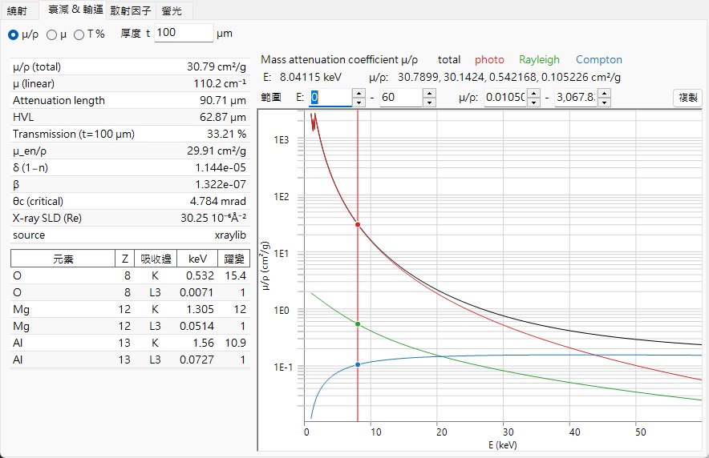
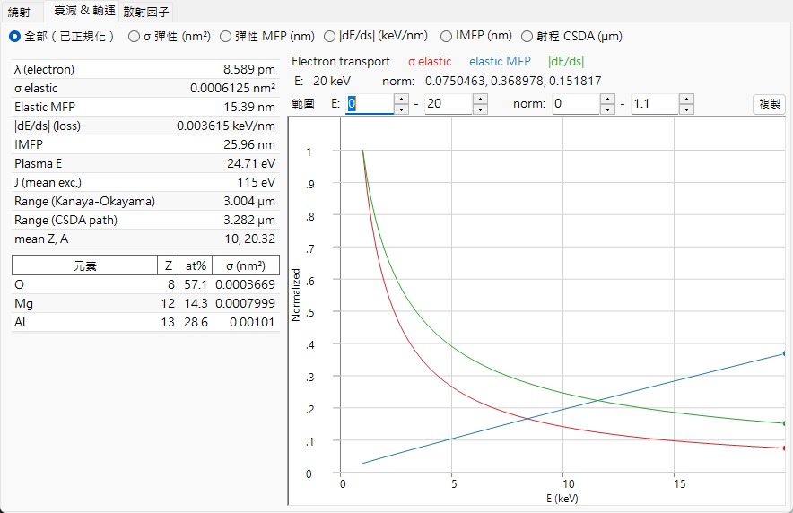
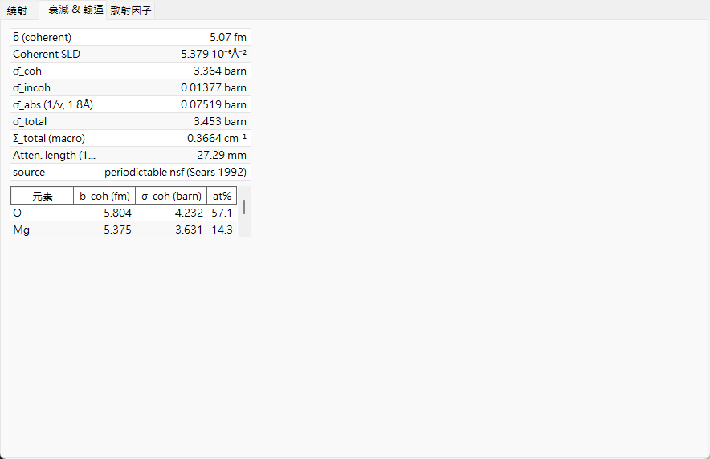

# 衰減與傳輸

散射因子描述的是單一散射事件；本頁討論的則是電子束**作為整體**穿過固體時所發生的事——它被移除的速度有多快、穿透得有多深，以及（對電子而言）如何被減速。對於三種射線而言，相關的物理機制完全不同，這正是 **Attenuations & Transport** 索引標籤的圖表與表格會隨射線種類而大幅變化的原因。

=== "X-ray"
    

=== "Electron"
    

=== "Neutron"
    

---

## X 射線——吸收與折射

### Beer–Lambert 衰減

單色 X 射線束隨路徑長度呈指數方式被移除：

$$I(t) = I_0\, e^{-\mu t}, \qquad \mu = \rho\,(\mu/\rho).$$

- $\mu/\rho$ ：**質量衰減係數**（cm²/g）——已表列、與密度無關的量。
- $\mu$ ：在材料實際密度 $\rho$ 下的**線性衰減係數**（cm⁻¹）。
- $1/\mu$ ：**衰減長度**（強度降至 $1/e$）。
- $\text{HVL} = \ln 2/\mu$ ：**半值層**。
- $T = e^{-\mu t}$ ：厚度為 $t$ 的試樣之透射率。

### $\mu/\rho$ 由什麼組成

總質量衰減是三種過程之和，並在索引標籤中分別繪出：

$$\left(\frac{\mu}{\rho}\right)_\text{total} = \left(\frac{\tau}{\rho}\right)_\text{photo} + \left(\frac{\mu}{\rho}\right)_\text{Rayleigh} + \left(\frac{\mu}{\rho}\right)_\text{Compton}.$$

對於化合物，質量衰減是各元素值的質量加權和，而線性係數則直接累加原子截面：

$$\left(\frac{\mu}{\rho}\right)_\text{mix} = \sum_i w_i\left(\frac{\mu}{\rho}\right)_i, \qquad \mu = \sum_i n_i\,\sigma_i,$$

其中 $w_i$ 為質量分率，$n_i$ 為數密度。三個分量為：

- **光吸收** $\tau$ ——一個光子被吸收並擊出一個束縛電子。它在低能量時占主導，介於各吸收邊之間大致按 $\tau/\rho \propto Z^{3\!-\!4}/E^{3}$ 下降。這正是擊出內殼層電子的項，該電子的弛豫會產生[螢光](fluorescence.md)。
- **Rayleigh（同調）**散射——在束縛電子上的彈性散射，與同調形狀因子 $F(q)$ 相關。
- **Compton（非同調）**散射——在弱束縛電子上的非彈性散射，與非同調函數 $S(q)$ 相關；其相對重要性在高能量時增加。被散射的光子在波長上移動了

$$\Delta\lambda = \lambda' - \lambda = \frac{h}{m_e c}\,(1-\cos\varphi),$$

  因此一次 Compton 事件會將該光子從單色束中移除（一種非彈性損耗）。

**吸收邊**是當光子能量越過某殼層（$K$、$L_3$、…）的束縛能、開啟新的游離通道時，$\tau$ 出現的陡升。**躍變比**是 $\mu/\rho$ 跨越吸收邊時增大的倍率；ReciPro 會列出 $K$ 與 $L_3$ 吸收邊的能量與躍變。**質能吸收係數** $\mu_\text{en}/\rho$ 是 $\mu/\rho$ 中將能量沉積於局部的部分（不含被散射光子與螢光光子帶走的能量）。

### 折射、臨界角與 SLD

固體的 X 射線折射率**略小於 1**，寫作

$$n = 1 - \delta + i\beta, \qquad \beta = \frac{\mu_\text{abs}\lambda}{4\pi} = \frac{r_e\lambda^2}{2\pi}\sum_i n_i\,f''_i, \qquad \delta \simeq \frac{r_e\lambda^2}{2\pi}\sum_i n_i\,(Z_i+f'_i),$$

其中 $n_i$ 是元素 $i$ 的數密度，$r_e$ 是經典電子半徑。此處 $\mu_\text{abs}$ 是衰減中的吸收性部分（與 $f''$ 相連結）；它不必等於上面的總 $\mu$，後者還包含 Rayleigh 與 Compton 散射。由於 $n<1$，X 射線在一個微小的掠射**臨界角**以下會發生**全外反射**

$$\theta_c \simeq \sqrt{2\delta}.$$

這源自折射幾何：對於掠射角 $\alpha$，固體內部的垂直波向量為 $k_z^2 \simeq k^2(\alpha^2 - 2\delta)$，在 $\alpha = \alpha_c = \sqrt{2\delta}$ 時降為零；在此之下，波無法傳入材料而被全反射。**散射長度密度**的實部，$\text{SLD} = r_e\sum_i n_i (Z_i + f'_i)$，決定了 $\delta$，並且是反射測量中所用中子 SLD 的 X 射線類比量。ReciPro 在純量表中報告 $\delta$、$\beta$、$\theta_c$ 與 X 射線 SLD。

---

## 電子——散射、減速與射程

固體中的快速電子既會**散射**（改變方向），又會持續**損失能量**，因此其傳輸需要不只一個長度尺度。

### 彈性散射與平均自由程

彈性截面 $\sigma_\text{el}$ 量度單一原子使電子偏轉的難易程度。ReciPro 使用 **NIST Mott** 截面（在遮蔽原子位能中對相對論性 Dirac 方程的分波解），大致在 **50 eV – 36.4 keV** 範圍內有效；超出此範圍，或對於不在表中的元素，則回退至**遮蔽 Rutherford** 近似。兩者在邊界處不必完美平滑地銜接。總截面是微分截面的角度積分，

$$\sigma_\text{el} = 2\pi\int_0^\pi \frac{d\sigma}{d\Omega}\,\sin\Theta\,d\Theta, \qquad \frac{d\sigma}{d\Omega} \propto \frac{Z^2}{E^2}\,\frac{1}{\big[\sin^2(\Theta/2)+\eta\big]^2},$$

其中遮蔽參數 $\eta$ 平緩了裸 Rutherford 截面的前向發散；Mott 處理額外納入了遮蔽 Rutherford 所略去的自旋與相對論效應。由截面可得

$$\Sigma_\text{el} = \sum_i n_i\,\sigma_{\text{el},i}, \qquad \lambda_\text{el} = \frac{1}{\Sigma_\text{el}},$$

即巨觀散射係數與**彈性平均自由程**——彈性事件之間的平均距離。

### 阻止本領與非彈性損耗

能量主要因電子激發（游離、電漿子）而損失。**阻止本領**定義為一個正量，

$$S(E) = -\frac{dE}{ds} > 0,$$

此處 $s$ 是沿軌跡的**路徑長度**（索引標籤中 *|dE/ds|* 曲線的變數），而非本附錄其他地方所用的散射變數 $\sin\theta/\lambda$。能量梯度 $dE/ds$ 為負，因此索引標籤將 $S$ 向上繪出。在 keV 能量下，它在概念上遵循 **Bethe** 形式

$$S(E) \;\propto\; \frac{Z\rho}{A}\,\frac{1}{E}\,\ln\!\frac{E}{J},$$

其中 $J$ 是固體的**平均激發能**。此非相對論性的草圖僅顯示其標度關係；ReciPro 評估的是一個經修正/經驗的形式（Joy–Luo 類型），在低能量時仍保持良好行為。純量表中的**電漿子能量** $E_p$ 是同一類電子激發的一個相關但獨立的特徵量。**非彈性平均自由程**（IMFP）是相對應的、損失能量的碰撞之間的平均距離；ReciPro 可由 **TPP-2M** 預測公式評估之，

$$\lambda_\text{in}(E) = \frac{E}{E_p^2\left[\beta_\text{T}\ln(\gamma_\text{T} E) - C/E + D/E^2\right]},$$

其中 $E$ 以 eV 為單位、$\lambda_\text{in}$ 以 Å 為單位，參數 $\beta_\text{T},\gamma_\text{T},C,D$ 由 $E_p$、密度、能隙與價電子數構成。

### 兩種射程

- **CSDA 射程**——連續減速近似（continuous-slowing-down approximation）對阻止本領積分，給出電子停下之前所行進的總路徑長度：

$$R_\text{CSDA} = \int_{E_\text{cut}}^{E_0} \frac{dE}{S(E)}.$$

（實務上積分一直向下進行到一個低能量截止值 $E_\text{cut}$，在此之下上述 Bethe 草圖不再成立。）

- **Kanaya–Okayama 射程**——一個被廣泛使用的**穿透深度**（而非路徑長度）經驗估計值，考慮了曲折、被散射的軌跡：

$$R_\text{KO}\,[\mu\text{m}] = 0.0276\,\frac{A\,E_0^{1.67}}{\rho\,Z^{0.89}}, \qquad (E_0\ \text{in keV}).$$

兩者回答的是不同問題——所飛行的總距離 vs. 電子伸入固體有多深——因此在數值上不同，ReciPro 兩者皆報告。這些射程決定了[電子軌跡](../../8-electron-trajectory.md)與 EBSD 模擬背後的交互作用體積。

---

## 中子——巨觀截面與 1/v 定律

對於中子並沒有與能量相關的衰減曲線；其交互作用由**核截面**所固定。電子束透過巨觀總截面而衰減，後者本身即同調、非同調與吸收三部分之和：

$$\Sigma_\text{total} = \sum_i n_i\,\sigma_{\text{total},i}, \qquad \sigma_\text{total} = \sigma_\text{coh} + \sigma_\text{inc} + \sigma_\text{abs}(\lambda), \qquad T = e^{-\Sigma_\text{total} t},$$

其衰減長度為 $1/\Sigma_\text{total}$。吸收部分取決於中子速度 $v$（因而取決於波長）：對於大多數核種，在核附近所停留的時間按 $1/v$ 標度，給出 **1/v 定律**

$$\sigma_\text{abs}(\lambda) = \sigma_\text{abs}(\lambda_0)\,\frac{\lambda}{\lambda_0}, \qquad \lambda_0 = 1.798\ \text{Å}\ (\text{thermal}, 2200\ \text{m/s}).$$

少數強吸收體（Cd、Sm、Eu、Gd）具有低能量**共振**，違反了單純的 1/v 標度；ReciPro 會標記這些核種。同調**散射長度密度**，$\text{SLD} = \sum_i n_i\, b_{\text{coh},i}$，是上述 X 射線 SLD 的中子類比量。

---

## 穿透深度一覽

三種射線探測的深度差異極大——這正是它們回答不同問題的實務原因：

| 射線 | 典型試樣 | 穿透深度（數量級） | 由何決定 |
|---|---|---|---|
| X 射線（≈8 keV） | 粉末 / 單晶 | 10–100 µm | $\mu = \rho(\mu/\rho)$ |
| 電子（≈200 keV） | TEM 薄膜 | 10–100 nm（可用） | 彈性 MFP + 非彈性損耗 |
| 中子（熱中子） | 塊體、cm 尺寸 | 1–10 cm | $\Sigma_\text{total}$ |

同樣的長度尺度解釋了為何電子需要超薄試樣與動力學理論，而中子則能在單次散射運動學下看穿整個塊體試樣。

---

## 另請參閱

- [原子散射因子](scattering-factor.md) ——Rayleigh/Compton 背後的 $F(q)$/$S(q)$ 拆分，以及 Mott 截面。
- [螢光](fluorescence.md) ——X 射線光吸收之後的弛豫。
- [3. 電子束交互作用](../../3-beam-interaction.md) —— *Attenuations & Transport* 索引標籤。
- [8. 電子軌跡](../../8-electron-trajectory.md) · [12. EBSD 模擬](../../12-ebsd-simulation.md) ——電子射程被使用之處。
