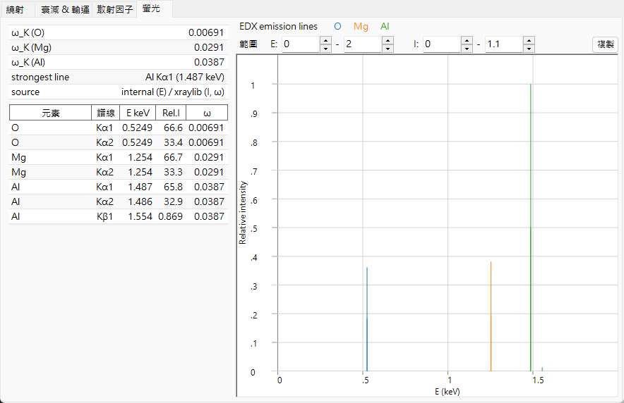

# 螢光

當 X 射線的**光吸收**將內殼層電子擊出（參見[衰減與傳輸](attenuation-transport.md)）時，會在深層能階留下一個空缺。原子藉由將外層電子落入此電洞而弛豫，釋放出的能量會以**特徵 X 射線光子**（螢光）的形式逸出，或是擊出第二個電子（即 **Auger** 過程）。**螢光** 索引標籤預覽特徵光子通道；它僅適用於 X 射線，對於電子束與中子束則隱藏。

---

## 特徵譜線

由於殼層能量定義得相當尖銳，發射出的光子能量為**兩個束縛能之差**，

$$E_\gamma = E_B(\text{inner shell}) - E_B(\text{outer shell}),$$

因此可作為該元素的特徵：

- **K 譜線** — $K$ 殼層的空缺由 $L$（$K\alpha$）或 $M$（$K\beta$）填補。
- **L 譜線** — $L$ 殼層的空缺由 $M$/$N$（$L\alpha$、$L\beta$、…）填補。

只有偶極選擇定則所允許的躍遷才會出現，這也是為什麼光譜是由少數幾條離散譜線（K$\alpha_1$、K$\alpha_2$、K$\beta_1$、L$\alpha_1$、…）所構成，而非連續譜。其能量遵循 **Moseley 定律**；在遮蔽類氫近似下，

$$E_{n_2\to n_1} \approx R_\infty hc\,(Z-\sigma)^2\left(\frac{1}{n_1^2} - \frac{1}{n_2^2}\right), \qquad \text{so}\qquad \sqrt{E} \propto (Z-\sigma),$$

其中 $\sigma$ 為遮蔽常數。對於 $K\alpha$（$n_2{=}2\to n_1{=}1$，$\sigma\approx1$），此式可化簡為 $E_{K\alpha}\approx R_\infty hc\,(Z-1)^2\left(1-\tfrac14\right)$。這種單調且由電子數驅動的 $Z$ 相依性，正是元素鑑定（EDX/WDX）的基礎。

---

## 螢光產率

輻射弛豫與 Auger 弛豫之間的競爭可由**螢光產率**來描述

$$\omega = \frac{\Gamma_r}{\Gamma_r + \Gamma_a},$$

即一個給定的空缺以發射光子而非 Auger 電子的方式衰變的機率（$\Gamma_r$、$\Gamma_a$ 分別為輻射率與 Auger 率）。

- 對於**輕元素**，Auger 通道佔主導，因此 $\omega_K$ 很小（對 C、N、O 而言遠低於 1%）— 輕元素的螢光很弱，這也是它們難以用 EDX 偵測的原因。
- 對於**重元素**，輻射通道勝出，且 $\omega_K \to$ 接近 1。

互補的 **Auger 產率** $a$ 佔據其餘部分，因此

$$\omega + a = 1 ,$$

而較小的 $\omega$ 意味著大多數空缺是透過 Auger 發射而衰變。在輻射通道之內，某一特定譜線 $\ell$（例如 $K\alpha_1$ 相對於 $K\beta_1$）所佔的比例即為其**分支比**

$$p_{\ell\mid X} = \frac{\Gamma_\ell}{\sum_{\ell'\in X}\Gamma_{\ell'}},$$

亦即殼層 $X$ 之內的相對輻射率。ReciPro 會列出每個元素的 $\omega_K$ 以及光譜中最強的譜線。

---

## 預覽所建模與未建模的內容

**EDX 發射譜線**圖會將每一條特徵譜線繪製為位於其光子能量處的一根豎線，高度正比於

$$\text{(atomic fraction)} \times \text{(radiative rate)} \times \omega.$$

這是一個關於譜線位置及其大致相對高度的**定性**預覽。它刻意省略了真實、定量的 EDX/XRF 光譜所需的各項因素：

- 入射能量是否確實**高於產生空缺所需的吸收邊** — 即使在目前能量下無法被激發，譜線仍會被繪製出來；
- **激發截面**（入射束在所選能量下產生空缺的效率）；
- 發射光子在試樣內部的**自吸收**（基質效應）；
- **偵測器效率**與解析度。

因此此預覽是用於譜線鑑定與相對位置的推斷，而非用於定量的成分分析。

---

## 從預覽到定量

真實的 EDX/XRF 分析透過**基質（ZAF）校正**將譜線強度轉換為濃度 — 包含原子序（$Z$）、發射光子在離開試樣途中的吸收（$A$），以及由其他譜線所激發的二次**螢光**（$F$）— 並結合上述的激發截面與偵測器響應。完整形式下，來自元素 $i$ 的譜線 $\ell$ 的量測強度為

$$I_\ell \;\propto\; C_i\,\Phi_0\,\sigma_{\text{ion},X,i}(E_0)\,\omega_{X,i}\,p_{\ell\mid X}\,\epsilon(E_\ell)\,A_\text{matrix}(E_0,E_\ell),$$

其中 $C_i$ 為濃度，$\Phi_0$ 為入射通量，$\sigma_\text{ion}$ 為游離截面，$\omega$ 為螢光產率，$p_{\ell\mid X}$ 為分支比，$\epsilon$ 為偵測器效率，$A_\text{matrix}$ 為吸收／二次螢光校正。ReciPro 的預覽僅保留 $C_i\,p_{\ell\mid X}\,\omega$ 這一部分（原子分率 × 輻射率 × 產率）而捨棄其餘，因此它能定出譜線位置並給出其本徵的相對強度，以便在量測光譜中加以辨識。

---

## 另見

- [衰減與傳輸](attenuation-transport.md) — 光吸收，即產生空缺的吸收邊。
- [原子散射因子](scattering-factor.md) — 同樣的束縛電子，從散射的角度來看。
- [3. 電子束交互作用 → 螢光 索引標籤](../../3-beam-interaction.md#fluorescence-tab)
