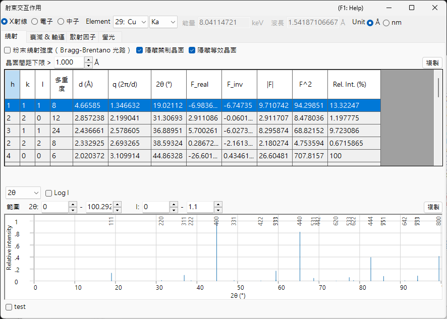

# 附錄 A2. 電子束交互作用 (固態物理背景)

主視窗章節 [3. Beam interaction](../../3-beam-interaction.md) 是 GUI 的操作指南：它告訴你該按哪些按鈕，以及每一欄代表什麼意思。本附錄則彙整這些數值背後的**固態與散射物理** — 為什麼原子對 X 射線、電子與中子的散射差異如此之大，結構因子及其虛部從何而來，電子束在固體內如何被衰減與減速，以及螢光預覽究竟代表與不代表什麼。

此視窗有四個索引標籤，而理論最好依照一個物理量饋入下一個物理量的順序來閱讀：

1. **[Atomic scattering factors](scattering-factor.md)** — *單一原子*如何散射每一種電子束。
2. **[Structure factor](structure-factor.md)** — *晶胞*中的原子如何彼此干涉，包括德拜-沃勒因子與消光規則。
3. **[Attenuation & transport](attenuation-transport.md)** — 電子束在穿越材料時如何被*移除與減速*。
4. **[Fluorescence](fluorescence.md)** — 內殼層游離之後伴隨而來的特徵 X 射線發射。

---

## 散射幾何與變數 $s$

此視窗中的每一個散射量都是電子束方向改變幅度的函數。以 $\mathbf k_i$ 與 $\mathbf k_s$ 分別表示入射與散射波向量 (彈性散射，故 $|\mathbf k_i|=|\mathbf k_s|=1/\lambda$)，則**散射向量**及其大小為

$$\mathbf Q = 2\pi(\mathbf k_s - \mathbf k_i), \qquad Q = |\mathbf Q| = \frac{4\pi\sin\theta}{\lambda} = 4\pi s .$$

- $\theta$ : 布拉格角 — 總散射角的*一半*。Reflections 表列出的是全角 $2\theta$。
- $s = \dfrac{\sin\theta}{\lambda}$ (Å⁻¹) : **Scattering factors** 索引標籤所對應繪製的變數。它是每一個原子形狀因子的自然引數。
- $d$ : 晶面間距。在布拉格條件 $\lambda = 2d\sin\theta$ 下，$s = \dfrac{1}{2d} = \dfrac{|\mathbf g|}{2}$，其中 $\mathbf g$ 為倒易點陣向量，$|\mathbf g| = 1/d$。

這三種慣例描述的是同一個幾何；只是尺度不同。由於此視窗同時使用了其中不止一種，因此值得把對應關係理清：

| 在視窗中 | 符號 | 關係 |
|---|---|---|
| Reflections 表 | $q = 2\pi/d$ | $q = 2\pi\lvert\mathbf g\rvert = Q = 4\pi s$ |
| Reflections 表 | $2\theta$ | 全散射角，$\sin\theta = \lambda s$ |
| Scattering factors 索引標籤 | $s = \sin\theta/\lambda$ | $s = q/4\pi = 1/(2d)$ |
| 繞射峰圖 | $Q = 4\pi\sin\theta/\lambda$ | $Q = q = 4\pi s$ |

!!! note "單位"
    形狀因子已發表的參數化以 Å⁻¹ 為單位表示 $s$ (故 $s^2$ 以 Å⁻² 為單位)，而 ReciPro 內部則以 nm⁻² 攜帶 $s^2$。兩者在 $s^2$ 上相差一個因子 $100$；曲線與表格皆以各表標頭所註明的單位呈現。有一個模型 — **Kirkland** — 是針對 $q = 2s = 1/d$ 而非 $s$ 製表的；參見 [Atomic scattering factors](scattering-factor.md)。

### 布拉格、勞厄與厄瓦爾德球 {#phase-convention}

布拉格條件是單一幾何要求的一個面向。建設性干涉 (**勞厄條件**) 要求散射向量等於一個倒易點陣向量，

$$\mathbf k_s = \mathbf k_i + \mathbf g, \qquad |\mathbf k_i + \mathbf g|^2 = |\mathbf k_i|^2 ,$$

在 $|\mathbf k_i|=|\mathbf k_s|=1/\lambda$ 下，化簡為

$$2\,\mathbf k_i\cdot\mathbf g + |\mathbf g|^2 = 0 \qquad\Longleftrightarrow\qquad |\mathbf g| = \frac{1}{d} = \frac{2\sin\theta}{\lambda},$$

亦即**布拉格定律** $\lambda = 2d\sin\theta$。在幾何上這就是**厄瓦爾德球**作圖法：當某反射的倒易點陣點落在半徑 $1/\lambda$ 的球面上時，該反射即被激發。(此處 $\mathbf g$ 以 $1/d$ 為單位，故 $\mathbf Q = 2\pi\mathbf g$。)

---

## 相位慣例

ReciPro 以結晶學相位慣例建構結構因子

$$F_{\mathbf g} = \sum_j \dots \exp\!\left(-2\pi i\,\mathbf g\cdot\mathbf r_j\right),$$

亦即指數中帶有一個**負**號。此選擇固定了結構因子虛部 (Reflections 表中的 `F_inv`) 的正負號，以及在開啟反常散射後 Friedel 對之間的關係。這裡只敘述一次，並在整個附錄中假定成立；其後果在 [Structure factor](structure-factor.md) 中詳細推演。

---

## 運動學散射與動力學散射

本附錄處理**單次 (運動學) 散射**：入射束只散射一次，繞射振幅即為下一頁所述的結構因子。當交互作用較弱時這是正確的圖像 — 幾乎所有試樣中的 X 射線與中子，以及*極薄*試樣中的電子。

當交互作用較強時 — 除最薄晶體以外的任何情況下的電子 — 電子束在離開之前會被多次散射，強度會在各反射之間重新分配，而 $\lvert F\rvert^2$ 不再給出量測到的強度。此情形需要 [Appendix A3](../a3-bloch-wave/index.md) 的**動力學**理論。這裡推導出的散射因子與結構因子是兩種圖像的*輸入*。

即使在運動學極限下，繞射振幅也不僅僅是結構因子：將散射波對厚度為 $t$ 的薄板加總可得

$$A_{\mathbf g}(t) \;\propto\; F_{\mathbf g}\int_0^t e^{\,2\pi i S_{\mathbf g} z}\,dz = F_{\mathbf g}\, t\, e^{\,\pi i S_{\mathbf g} t}\,\operatorname{sinc}(\pi S_{\mathbf g} t),$$

其中 $S_{\mathbf g}$ 為**偏離向量** — 倒易點陣點到厄瓦爾德球的距離。強度在 $S_{\mathbf g}=0$ 處達到尖銳峰值，並隨厚度振盪 (厚度條紋的起源)；[Appendix A3](../a3-bloch-wave/index.md) 的動力學理論以耦合多束行為取代了此單束結果。

---

## 三種探束一覽

| | X 射線 | 電子 | 中子 |
|---|---|---|---|
| 交互作用對象 | 電子密度 $\rho_e$ | 靜電位能 $V$ | 原子核 (及未配對自旋) |
| 交互作用強度 | 弱 | 強 | 極弱 |
| 典型穿透深度 | µm – mm | nm – µm | mm – cm |
| 單次散射是否成立？ | 幾乎總是 | 僅限薄膜 | 幾乎總是 |
| 對輕原子的靈敏度 | 差 ($\propto Z$) | 中等 | 通常極佳 |

這些對比在後續各頁中反覆出現，每一項皆可追溯至 [Atomic scattering factors](scattering-factor.md) 中的散射機制。

---

## 另請參閱

- [3. Beam interaction](../../3-beam-interaction.md) — 本附錄所說明的 GUI。
- [Atomic scattering factors](scattering-factor.md) · [Structure factor](structure-factor.md) · [Attenuation & transport](attenuation-transport.md) · [Fluorescence](fluorescence.md)
- [Appendix A1. Coordinate systems](../a1-coordinate-system/1-orientation.md)
- [Appendix A3. Dynamical diffraction (Bloch-wave method)](../a3-bloch-wave/index.md) — 使用這些散射因子的多重散射理論。
