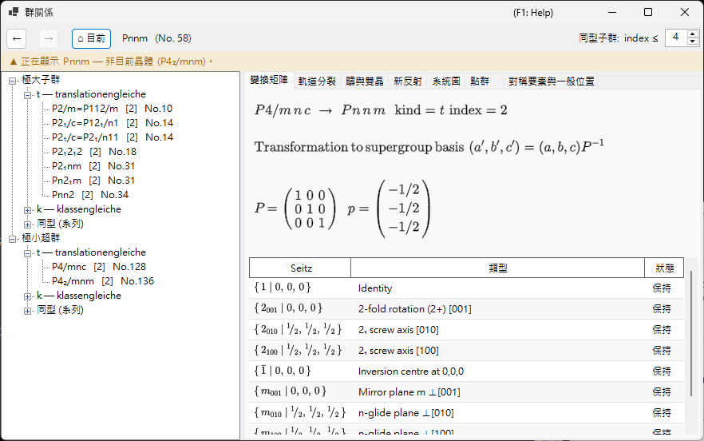
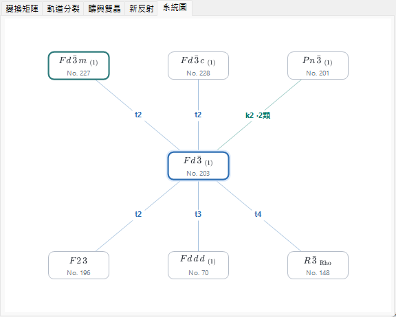
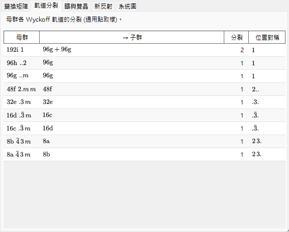
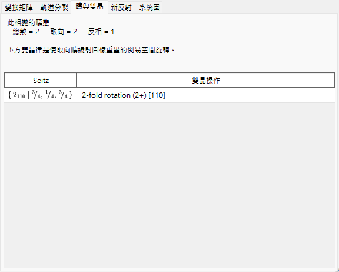
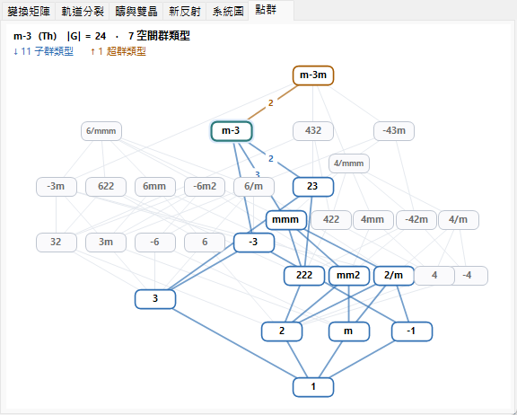
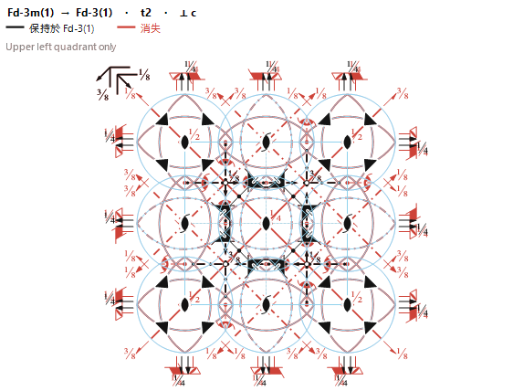

# A4.2. 群與子群的關係

**群關係...**（Group Relations...）是瀏覽 230 種空間群類型之極大子群／極小超群關係的瀏覽器，從 [對稱性資訊](../../2-symmetry-information.md) 的 **選項** 面板開啟。與靜態表格不同，它顯示的每一個關係都是在執行時直接由目前空間群自身的對稱操作（見 [A4.1](symbols-and-diagrams.md#對稱操作對稱操作索引標籤)）計算而得，因此可以逐一操作交叉核對，而不必只當作 *International Tables* Vol. A1 的轉錄照單全收。

本頁先說明瀏覽器所用的群論詞彙，再逐一介紹它的各個索引標籤。

---

## Hermann 定理：*t*-、*k*- 與同型子群

子群 $H<G$ 為**極大（maximal）**，是指 $G$ 中沒有任何子群嚴格介於 $H$ 與 $G$ 之間。Carl Hermann 的定理（1929）指出：對此處收錄的三維空間群而言，空間群 $G$ 的每一個極大子群必為以下兩種之一：

- **translationengleiche（*t*-）子群** — 「平移相等」：$H$ 保留 $G$ 的*全部*平移（同樣的點陣、同樣的晶胞），但點群較小。指數 $[G:H]$（$H$ 在 $G$ 中的陪集個數）等於點群指數 $[P_G:P_H]$。
- **klassengleiche（*k*-）子群** — 「晶類相等」：$H$ 保留與 $G$ *相同的幾何晶類*（點群類型），但只保留 $G$ 平移的一個子點陣 — 更大的慣用晶胞，及／或更少的心化向量。指數等於平移點陣指數 $[T_G:T_H]$。

**同型子群（isomorphic subgroup）**是 *k*-子群中特殊而重要的一類：$H$ 還與 $G$ 本身屬於*同一空間群類型*（只是晶胞更大 — 這種關係可以無限重複，因此同型子群構成以晶胞大小為指標的無窮系列，不同於給定 $G$ 只有有限多個的 *t*- 與非同型 *k*-子群）。對*極大*同型子群而言，指數必為質數冪（$p$，在三維中偶爾為 $p^2$ 或 $p^3$）；出現哪個冪次，取決於有限的商點陣在點群作用下如何作為模分解。另請注意，子點陣的基底變換可能帶有真正的基向量更換與原點位移，而不僅僅是沿某一軸將晶胞均勻放大。

由於每一個有限指數的子群關係（無論極大與否）都可以由極大步驟串接而成，只列出極大子群（以及反方向的極小超群）就足以描述有限指數子群關係的完整網絡 — 這正是 ITA Vol. A1 與本瀏覽器都只列出極大／極小關係的原因。

!!! note "只有兩種 — 同型是子類，不是第三種"
    人們常把「*t*-、*k*- 與同型子群」說成三者並列，本瀏覽器的樹狀檢視為方便起見也確實分成三個分支。但形式上，Hermann 定理是**二**分（*t* 或 *k*）；同型子群不過是恰好重現 $G$ 自身空間群類型的那些 *k*-子群。

### 指數：陪集的個數

由於空間群是無限群（它們包含平移），這裡的「指數」永遠指 **$H$ 在 $G$ 中的陪集個數**，而不是階數之比 $|G|/|H|$（兩個階數都是無限大）— 對有限群兩種概念一致，但對空間群只有數陪集的定義才有意義。樹狀檢視與變換矩陣索引標籤都以例如 `t, index 2` 或 `k, index 3` 的形式顯示此指數。

### 共軛子群與共軛類

一個給定的抽象子群關係，往往能在 $G$ 內以不止一種幾何上不同的方式實現 — 差別在取向或位置而非類型 — 例如某個鏡面的鏡像對應面，或沿另一個取向不同但對稱等價之方向的螺旋軸。兩個這樣的實現 $H$ 與 $H'$ 若對某個 $g\in G$ 滿足 $H' = gHg^{-1}$，則稱兩者**在 $G$ 內**共軛；瀏覽器把一個關係的所有 $G$-共軛複本歸為單一條目，並以*共軛類*的大小報告其個數。這比按 $G$ 的歐幾里得正規化子或仿射正規化子（normalizer）之下的（較粗的）等價來歸類 — ITA 本身有時改用的分類 — 嚴格更細，因此類型與指數相同的子群並不自動屬於同一個共軛類；它們可能分裂為數個。

---

## 瀏覽器的操作

- **樹**（左窗格）有兩個根節點：**極大子群** 與 **極小超群**，各自再分為 **`t — translationengleiche`** 分支、**`k — klassengleiche`** 分支與 **`同型 (系列)`** 分支。共用同一子類型與指數的非共軛類，其標籤原本會完全相同，因此以 `· 類 n` 後綴加以區分。在極大子群的**同型**分支中，於 $G$ 的*仿射正規化子*下彼此等價的共軛類會進一步歸入同一個軌道列（*「… — m 個類 (正規化子等價)」*）— 粒度與 ITA Vol. A1 的 IIc 條目相同 — 而列舉的上限由工具列的 **同型子群: index ≤** 微調按鈕設定（2–27，預設 4；更高的上限會在背景計算）。
- **系統圖** 索引標籤繪製簡化的 Bärnighausen 式骨架：目前的群居中（強調顯示），其極小超群在上、極大子群在下 — ***t*-、*k*- 與同型關係一視同仁**，因為每一個都是一步「極大步驟」。每條邊都標註其種類與指數（`t2`、`k3`、`i3`），並以顏色區分：*t* 為藍色、*k* 為藍綠色、同型為橙色。節點符號以正式的結晶學符號排版 — 螺旋軸為下標、旋轉反演為上劃線。共用同一目標類型、種類與指數的非共軛類會合併為單一節點，其邊標籤附上類數（例如 `k2 ·2類`）— 要逐類檢視，仍應回到樹狀檢視。當一列的關係多到超出視窗寬度時，節點會縮小一級，仍放不下的部分收攏為一個虛線 `+N` 節點（不可點按 — 完整清單請用樹狀檢視）；只要顯示了同型邊，角落就會出現小小的 `i: 僅 index ≤ 4` 提醒；*k*-超群反查仍在建構時則顯示 `k: 計算中…`。當你以雙擊逐層深入子群時，一路經過的群鏈（你的*選取分支*）會繪製為目前群上方的一條紫色垂直欄 — 即你自身轉移路徑的多層 Bärnighausen 樹（例如 $Pm\bar3m \rightarrow P4/mmm \rightarrow Pmmm \rightarrow \ldots$），每條邊都標註你所走過的關係；向上導覽或按下 **後退** 會相應地修剪該分支，祖先超過三層的鏈則以淡化的 `⋮ +N` 縮略表示。此圖呈現的僅是群論骨架 — 結構關係意義下完整的 Bärnighausen 樹還會在每條邊上帶著晶胞變換、Wyckoff 分裂與原子座標的對應關係，那些內容收錄在下文的其他索引標籤中，而不在系統圖上。
- **單擊**（樹節點或系統圖節點）選取一個關係並填入下方的詳細索引標籤。**雙擊**則是*導覽*：它把整個瀏覽器以該空間群為新的根重新展開，因此可以一步一步從群走到子群、再走到子群的子群。
- **後退／前進／目前** 可在導覽歷史中前後移動；**目前** 永遠回到你實際開啟此瀏覽器時之晶體的空間群。
- 上方的**導覽路徑（breadcrumb）**顯示目前檢視中的空間群（`HM 符號 (No. n)`）；其下的**情境橫幅**在該群與你的晶體一致時呈綠色（「正在顯示目前晶體的空間群。」），在你導覽到別處時呈琥珀色（「正在顯示 … — 非目前晶體 (…)。」）— 提醒你瀏覽子群並*不會*變更你的晶體。

---

## 變換矩陣索引標籤

顯示母設定與子設定之間的基底變換與原點位移，採用 ITA 的慣例：新基向量為 $(\mathbf a',\mathbf b',\mathbf c')=(\mathbf a,\mathbf b,\mathbf c)\cdot P$，一點在母設定中的座標為 $\mathbf x_{\text{parent}} = P\,\mathbf x_{\text{child}} + \mathbf p$。$3\times3$ 矩陣 $P$ 與原點位移 $\mathbf p$ 以分數列印。

- 當你是從 **極大子群** 抵達此關係時，直接顯示 $P$ 與 $\mathbf p$（母 → 子方向）。
- 當你改從 **極小超群** 抵達時，索引標籤顯示 $P^{-1}$（以及相應反轉的位移），並加註*「由超群自身的子群表推得」* — 瀏覽器一律以較大之群的觀點儲存關係，需要時再即時求逆，而不是維護兩份獨立的副本。
- **本類共軛子群數: $n$** 報告上文所述共軛類的大小。
- 生成元表列出每一個陪集代表元，標記為 **保持**（仍存在於 $H$ 中）或 **消失**（存在於 $G$ 但不在 $H$ 中 — 這些正是造成對稱性破缺的操作），各附 [A4.1](symbols-and-diagrams.md#對稱操作對稱操作索引標籤) 中的 Seitz 符號與幾何類型描述。
- 若某候選關係的目標空間群類型無法與 ReciPro 的目錄比對確認，索引標籤會直白說明而不臆測，並僅顯示點群符號。

---

## 軌道分裂索引標籤

顯示對稱性降至 $H$ 時，*母*群的每個 Wyckoff 位置如何分裂：每列對應母群的一個位置，列出母群的多重度／字母／位置對稱性、所得子群的多重度／字母（軌道分裂為多於一片時以 `+` 連接）、分裂成幾片，以及各不相同的子群位置對稱性。

計算方式是把**一個固定的通用（generic）取樣點**實際代入兩個群的操作並比較所得軌道 — 這是數值上*取樣*的分裂，而非完全符號化的 Wyckoff 分裂形式體系（如 WYCKSPLIT 之類工具所用）；正因如此，它刻意命名為「軌道分裂」而非「Wyckoff 分裂」— 完全符號化的處理原則上能追蹤每一種特殊參數下的重合，而此取樣方法只報告在單一通用點所見的分裂，無法自行標出僅在 $x,y,z$ 取特殊值時才發生的重合。

對 ***k*- 或同型關係**，同樣的取樣方法施加於變粗的平移點陣：索引標籤顯示隨著點陣平移喪失，母群的各軌道如何分裂；子群多重度以**擴大的子群晶胞**計數（因此對指數 $n$ 的晶胞擴大，各分裂片段的多重度之和為母群多重度的 $n$ 倍）。

---

## 疇與雙晶索引標籤

當晶體從 $G$ 轉變為子群 $H$ 時，$H$ 在 $G$ 中的 $[G:H]$ 個陪集各對應一個可能的**疇態**：參考態是恆等陪集，其他每個陪集 — 由變換矩陣索引標籤中的一個「消失」操作代表 — 各生成一個由該操作與參考態相關聯的疇態。

對 ***t*-子群**而言，平移點陣不變（$T_G=T_H$），因此就群論而言，這裡不存在**反相（平移）疇**這種東西 — 每個疇態與參考態的差異必是一個真正的點群操作，絕不會只是單純的平移。因此此索引標籤一律報告 `反相 = 1`、`取向 = 總數`，亦即全部 $[G:H]$ 個疇態都是**取向疇**。

對 ***k*- 或同型**轉變，情況恰好相反：點群不變，所以**取向態只有一個**，而失去的點陣平移生成**反相（平移）疇** — 索引標籤報告 `取向 = 1`、`反相 = 總數`。每個失去的平移以純平移的 Seitz 符號列出，並附以子群晶胞表示的對應反相向量。由於所有反相疇共享同一取向，其基本反射完全重合；只有超結構反射（見 **新反射** 索引標籤）在跨越反相疇界時帶有相位差。

一對取向疇之間的**雙晶律**，就是消失操作的矩陣部 — 表示為作用於正點陣或倒易點陣的旋轉或鏡映 — 它把一個疇的點陣取向映到另一個疇的取向上。對 *t*-子群轉變而言，這個操作依構造正是*母*群 $G$ 之點陣的對稱操作，因此若低對稱結構的實際度量仍保有該點陣對稱性，施加雙晶操作後兩個疇的倒易點陣就完全重合、繞射圖樣完全重疊 — 這正是此索引標籤所描述的理想化情形（*merohedral* 雙晶）。在真實轉變中，低對稱相通常會發展出小的自發應變，只近似地保持母群的度量，因此實務上重疊往往只是近似的（*pseudo-merohedral* 雙晶）；此索引標籤報告的是群論上、嚴格度量下的雙晶律，而不是對某一實際晶體與其接近程度的量測。

陪集清單為空的退化情形報告為 `(單疇)`（指數 1 不會作為關係顯示）。

---

## 新反射索引標籤

對 *t*-子群轉變，列出在 $G$ 中系統性消光、在 $H$ 中卻變為對稱性允許的反射 — 亦即母群的反射條件（見 [條件](../../2-symmetry-information.md) 索引標籤）禁止、而 $H$ 的反射條件不禁止的反射。搜尋範圍由索引標籤上的 **搜尋範圍** 數值框設定：預設 $|h|,|k|,|l|\le4$，可在 2 到 8 之間調整（上限越大，列出的反射可能越多）。

由於 *t*-子群絕不擴大晶胞，這些**不是**超結構／分數指數反射 — 它們仍是母晶胞的整數 $(h,k,l)$，只是因為原本迫使它們消失的滑移面或螺旋軸不復存在，才變為*允許*。（母指數為分數的真正超結構反射，唯有晶胞本身擴大時才可能出現，而那發生於 *k*-子群，不是 *t*-子群。）出現在這裡的反射僅是對稱性上*允許*而已；實際上是否觀測得到，仍取決於真實低對稱結構的結構因子。

對 ***k*- 或同型關係**，此索引標籤以**擴大的子群晶胞為指標**列出新反射（同樣以搜尋範圍為限），並在最後一欄將每個反射分類：

- **超結構反射**對應到*分數*母指數，以括號顯示（例如 `(1/2 0 1)`）— 它們純粹因晶胞擴大而出現；
- **釋放反射**在母晶胞中為整數指數，但原先被某條母群反射條件禁止、如今被子群解除 — 此時改為顯示被解除的母群規則（這也包括心化平移的喪失，例如 $I$ 心母群失去其 $h+k+l$ 為偶數的條件）。

母群與子群皆允許的反射（基本反射）不予列出。若子群的空間群類型無法確認，則子群的反射條件不明，索引標籤會說明無法進行預測。

---

## 點群索引標籤

瀏覽器的其他部分是在各個*空間*群之間行走，此索引標籤則展示這些行走所依附的更大地圖：**32 種結晶學點群類型（幾何晶類）的 Hasse 圖** — 即哪種類型作為哪種類型之子群出現的偏序關係。每個節點代表一種點群類型；縱軸為群的階數（底部為 1、頂部為 48，取對數刻度），其中六方／三方晶族構成左側的塔，立方–正方–斜方一系的塔則在右側。每條邊代表一個*極大*（覆蓋）子群關係 — 沒有第三種類型嚴格介於兩者之間 — 32 種類型之間恰有 80 條這樣的邊。此圖是一個偏序，但*不是*數學意義下的格（lattice）：它有兩個極大元 $m\bar3m$ 與 $6/mmm$，彼此不可比較。

- 你正在瀏覽之空間群的點群帶有淡藍色光暈（如同系統圖索引標籤中的目前節點），預設即為*聚焦*的類型。
- **單擊**任一節點可改為聚焦該類型：其**子群類型以藍色強調顯示**、**超群類型以橙色強調顯示**，而聚焦節點自身各邊上的數字，則是該極大步驟的**指數**（階數之比）。與焦點無關的類型維持灰色。點按空白處會把焦點交還給目前的點群。（點按絕不會導覽到任何地方 — 一種點群類型對應許多空間群，而非某一個。）
- 頂部的說明文字概括聚焦的類型：Hermann–Mauguin 與 Schoenflies 符號、群的階數 $|G|$、230 種空間群類型中有多少屬於它，以及其子群／超群集合的大小。

此圖正是 Hermann 定理投射在點群上的影子：樹狀檢視中的一步 *t*-子群步驟，在這裡恰好沿一條邊向下移動（*t*-步驟的空間群指數等於該邊上的點群指數），而 *k*- 步驟與同型步驟則停留在同一個節點上。

---

## 對稱要素索引標籤

**變換矩陣**索引標籤以表格列出保持與消失的操作，本索引標籤則把相同的資訊以*幾何方式*呈現，疊繪在母群的[對稱要素示意圖](symbols-and-diagrams.md#symmetry-element-diagram)上（即帶有軸、面與對稱心的 ITA Vol. A 風格圖）。它一眼就回答了「當晶體從 $G$ 轉變為子群 $H$ 時，哪些對稱要素存續、哪些破缺」— 就在結晶學家早已熟讀的同一張圖裡。

- **$H$ 中保持的要素以黑色繪出；消失的要素以紅色繪出。**投影方向（⟂ *a*、*b* 或 *c*）依母群的晶系自動選定，標頭並標明該關係與投影方向。
- 對稱要素退化為較低者時會如實呈現：例如一條退化為 2 重的 4 重軸，會顯示為**紅色的 4 重符號、其上疊繪一個黑色的 2 重符號** — 紅色表示「4 重已消失」，黑色表示「此處仍保留一個 2 重」。
- 此疊繪的作法，是先繪出完整的母群示意圖（作為*消失*的基準底圖），再於其上重繪直接由 $H$ 自身操作集合重建而得的對稱要素 — 因此保持的要素正是那些在 $H$ 中重新出現者，無需逐一符號臆測。

本索引標籤依子群晶胞與母群晶胞的關係，處理三種情形：

- **相同慣用胞** — *translationengleiche*（*t*-）子群，以及僅移除心付向量的 *klassengleiche*（*k*-）子群（子點陣基的行列式 $= 1$）。此時 $H$ 的要素落在母群晶胞內，故重疊圖為單一晶胞的圖。（移除心付的 *k*- 關係，例如 $I$ 心或 $F$ 心 $\to$ 簡單格子，會使心付所生成的螺旋軸與滑移面變紅。）
- **面內晶胞擴大** — 擴大位於 *a*–*b* 面內（$a'=n_a a$，$b'=n_b b$，*c* 不變）的正交、四方或立方母群的 *k*- 或同型關係。擴大後的晶胞（投影 ⟂ *c*）繪製為 $n_a\times n_b$ 個母胞方塊的網格，且**每塊方塊獨立著色**：在 $H$ 中保持的對稱要素，於該副本得以留存的方塊中為黑色，於晶胞擴大已將其移除處為紅色 — 於是晶胞倍增直接表現為每隔一個副本變紅。
- **其他情形**（沿視線軸 *c* 的擴大、斜交/非正交的晶胞變換、六方/三方/單斜母群）失去的對稱無法在二維投影中無歧義地繪製，故索引標籤顯示一段簡短說明，指向**疇與雙晶**與**新反射**索引標籤 — 這兩者對該類情形已載有失去之點陣對稱性的資訊。

---

## 目前的限制

瀏覽器的 *t*- 與 *k*-子群引擎、*t*- 與 *k*-超群反查，以及同型（IIc）分類均已完整實作，並已對照空間群操作表獨立驗證；**軌道分裂**、**疇與雙晶** 與 **新反射** 各索引標籤對所有種類的關係都是即時運作的。尚存的限制會如實顯示，而非默默省略：

- **同型子群列舉至微調按鈕所設的上限（預設 index ≤ 4，最高 27）。**同型系列會無限延伸到更高的指數，因此該分支上灰色的註記永遠標明目前的上限，而不是佯裝清單已完整。正規化子軌道的歸併仰賴對正規化子生成元的有界搜尋；就已測試的案例而言均已對照 ITA A1 驗證，但對每一個群的形式完備性證明仍是未來的工作 — 最壞的情況是一個軌道被拆成多列顯示，絕不會被錯誤地合併。
- ***k*-超群**在首次使用時於背景計算（反查需要同一晶類中每個類型的 *k*-子群表）；就緒之前，樹狀檢視會短暫顯示灰色的*「計算中…」*節點（系統圖角落則顯示*「k: 計算中…」*註記）。

---

## 詞彙表

| 術語 | 意義 |
|---|---|
| 極大子群 / 極小超群 | 與 $G$ 之間沒有其他子群關係嚴格介於其間的子群（超群） |
| 指數 $[G:H]$ | $H$ 在 $G$ 中的陪集個數 |
| *translationengleiche*（*t*-） | 平移點陣相同、點群較小；指數 = 點群指數 |
| *klassengleiche*（*k*-） | 點群類型相同、平移為子點陣（更大晶胞）；指數 = 點陣指數 |
| 同型子群 | 還與 $G$ 屬於同一空間群類型的 *k*-子群 |
| 共軛類（$G$ 內） | 一個子群關係的所有 $G$-共軛（$gHg^{-1}$）實現的集合 |
| 取向疇 | 由點群操作與參考態相關聯的疇態 |
| 反相（平移）疇 | 僅由失去的平移與參考態相關聯的疇態（*k*- 轉變才可能，*t*- 不可能） |
| 雙晶律 | 消失操作的矩陣部，把一個取向疇的點陣映到另一個之上 |

---

## 另請參閱

- [2. 對稱性資訊](../../2-symmetry-information.md) — 本附錄所解說的 GUI 指南。
- [A4.1. 空間群符號與對稱性示意圖](symbols-and-diagrams.md) — 變換矩陣與疇與雙晶索引標籤通篇使用的 Seitz 符號／幾何類型語彙。
- [附錄 A4. 對稱性與空間群](index.md)
