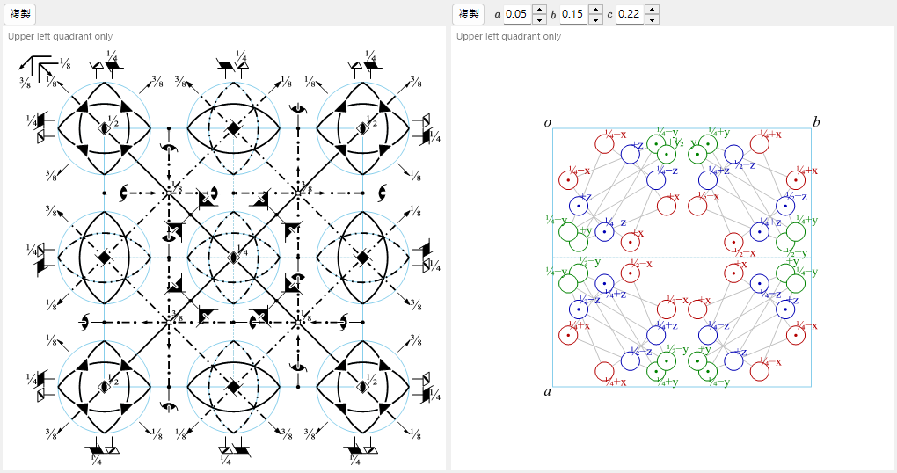

# A4.1. 空間群符號與對稱性示意圖

本頁說明 [對稱性資訊](../../2-symmetry-information.md) 上半部（空間群識別面板，以及 **對稱操作**／**群性質**／**設定一覽** 索引標籤）所顯示的一切，以及視窗下方的兩個示意圖。所有記號皆遵循 *International Tables for Crystallography*（ITA）Vol. A。

---

## Hermann–Mauguin (HM) 符號

Hermann–Mauguin 符號有兩個層次：**點群符號**（上方方塊 *點群*）僅描述晶體的巨觀對稱性，**空間群符號**（下方方塊 *空間群*）則再加上點陣心化與任何螺旋／滑移成分。

### 點陣字母

空間群符號以七個標準點陣字母之一開頭：

| 字母 | 意義 |
|---|---|
| `P` | 簡單（primitive） |
| `A`, `B`, `C` | 單面心（分別於 *bc*、*ac*、*ab* 面心化） |
| `I` | 體心 |
| `F` | 全面心 |
| `R` | 菱面體（三方晶系特有的點陣；常以*六方軸*描述，此時晶胞內含三個陣點） |

### 對稱方向

點陣字母之後，符號中其餘的每個位置各代表一個**對稱方向** — 即晶體中旋轉／螺旋軸所沿的方向，及／或鏡面／滑移面所垂直的方向。這些位置指的是哪些實際方向、依什麼順序排列，由晶系決定：

| 晶系 | 第 1 位置 | 第 2 位置 | 第 3 位置 |
|---|---|---|---|
| 三斜晶系 | （無 — 僅 `1` 或 `-1`） | | |
| 單斜晶系 | $[010]$（唯一軸 $b$，ReciPro 的慣例） | | |
| 斜方晶系 | $[100]$ | $[010]$ | $[001]$ |
| 正方晶系 | $[001]$ | $[100],[010]$ | $[110],[1\bar 10]$ |
| 三方晶系／六方晶系 | $[001]$ | $[100],[010],[\bar 1\bar 1 0]$ | $[1\bar 10],[120],[\bar 2\bar 1 0]$ |
| 立方晶系 | $[100],[010],[001]$ | $[111]$（*以及其餘 3 條體對角線*） | $[1\bar 10],[110]$（*以及其餘 4 條面對角線*） |

單一位置依下列規則填入：

- 單獨的數字 $n$（$n=1,2,3,4,6$） : 沿該方向的 $n$ 重**旋轉**軸。
- 螺旋軸 $n_p$（例如 $2_1$、$4_2$、$6_3$） : $360°/n$ 的旋轉*結合*沿軸方向點陣週期 $p/n$ 的平移。例如 $2_1$（「二重螺旋」）表示旋轉 $180°$ **並**沿軸平移半個晶胞邊長；$6_3$ 表示旋轉 $60°$ 並沿 $c$ 平移半個晶胞邊長。
- 前面沒有旋轉數字的單獨字母（$m,a,b,c,n,d$） : 垂直於該方向的**鏡面或滑移面**（字母的意義與下文示意圖一節相同）。
- $n/m$ 或 $n_p/m$ : 旋轉／螺旋軸**加上**與其垂直的鏡面（兩個元素共用同一方向，一個沿軸、一個橫切）。
- $-n$（例如 $-1,-3,-4,-6$） : **旋轉反演**軸（旋轉 $360°/n$，再對軸上一點反演）。單獨的 $-1$ 表示純反演中心；不存在「$-2$」軸這種東西，因為二重旋轉反演與鏡面完全相同，故一律寫成 $m$。

### 簡式符號與全式符號

**簡式** HM 符號（通常被引用的那一個）省略了已由寫出的元素所隱含的對稱元素；**全式**符號則把每個方向逐一寫出。例如空間群 No. 62 的簡式為 $Pnma$，全式為 $P\,2_1/n\,2_1/m\,2_1/a$ — 三條 $2_1$ 螺旋軸已由三個滑移／鏡面連同空間群的點群 $mmm$ 隱含，因此簡式符號將它們略去。ReciPro 的 *HM 符號（簡式）* 與 *HM 符號（全式）* 欄位同時顯示兩者；對多數空間群而言兩者一致。

### Schoenflies (SF) 符號與 Hall 符號

**Schoenflies 符號**（例如 $D_{2h}^{16}$）指出點群類型（$D_{2h}$），再加一個上標，單純用來列舉「這是該點群家族中的第幾個空間群」— 與 HM 符號不同，這個上標本身不帶任何直接的幾何意義；必須查表對照。ReciPro 對點群與空間群都會顯示 Schoenflies 符號。

**Hall 符號**是另一套以生成元為基礎、為電腦處理的無歧義性而設計的記法：它列出一組最小的生成操作連同明確的原點，程式因此無需查「這個 HM 符號隱含哪個設定／原點選擇」的對照表，就能重建精確的座標集合。Hall 符號並非編碼給定操作集合的*唯一*方式（不同的生成元選擇會為同一個群給出不同但同樣有效的 Hall 字串），但每一個 Hall 符號本身都是完全明確且可逆的。ReciPro 顯示為目前設定系統化產生的一個 Hall 符號；**設定一覽** 索引標籤（見下文）列出與目前空間群編號相同的所有收錄原點／設定選擇，各附其 HM 與 Hall 符號。

---

## 對稱操作（對稱操作索引標籤）

**對稱操作** 索引標籤以三種並列的記法，列出目前設定下一般位置的每一個對稱操作（點陣心化平移已展開計入）：

| 欄 | 範例 | 意義 |
|---|---|---|
| 座標 | `-y, x-y, z+1/3` | 座標三元組 $(x,y,z)\mapsto(x',y',z')$，即以代數方式寫出的仿射映射 $x'=Rx+t$（ITA/CIF 慣例）。 |
| Seitz | `3+ [111]` | 簡潔的符號：旋轉／螺旋的重數與旋向（`3+`）、軸方向（`[111]`），以及（若有）該操作的平移，例如 `2₁ [001] 0,0,1/2`。純鏡面為 `m`，恆等操作為 `1`，反演為 `-1`。 |
| 類型 | `3-fold rotation (3+) [111]` | 操作的淺白分類：`Identity`（恆等）、`Inversion centre at …`（反演中心）、$n$ 重旋轉、$n_p$ 螺旋軸、鏡面 $m$、$a/b/c/n/d$ 滑移面，或 $n$ 重旋轉反演，各附其方向（反演中心並附其位置）。 |

**複製 (CIF)** 按鈕會將完整操作清單以 CIF 的 `_space_group_symop_operation_xyz` 迴圈形式放入剪貼簿。這套語彙 — Seitz 符號與幾何類型 — 會在 [A4.2](group-subgroup-relations.md) 中反覆出現：子群關係中每個保持／消失的生成元都以同樣的方式描述。

---

## 群論分類（群性質索引標籤）

**群性質** 索引標籤報告目前空間群的一組標準分類。其中一部分 — 中心對稱、Sohncke 與極性（以及由此導出的下文物理性質允許表）— 直接由每個操作的**矩陣部** $R$（線性的旋轉或鏡映部分）決定；中心對稱還需連同平移部一併考慮。其餘各項 — 簡單型（symmorphic）、對映體夥伴、晶族／格子系／布拉維型、算術晶類與 Patterson 對稱 — 則是空間群*類型*整體的性質（其 IT 編號、點陣類型與勞厄類），而非任何單一操作的性質。這一切都不需要度量（晶胞形狀）— 只取決於空間群類型的抽象對稱內容與分類。

**中心對稱** — 操作集合中含有形如 $\{-I \mid t\}$ 的操作（對點 $t/2$ 的反演，該點不必是原點）。下述 Sohncke 與極性兩項性質與此互斥：反演中心會反轉所有方向，所以中心對稱群絕不可能是極性的；且 $-I$ 的行列式為 $-1$，所以中心對稱群也絕不可能是 Sohncke 群。

**Sohncke（保向）群** — *每一個*操作的矩陣部都滿足 $\det R=+1$：群中只含真旋轉與螺旋旋轉，絕無鏡面、滑移、反演或旋轉反演。230 種空間群類型中有 65 種是 Sohncke 群。Sohncke 群是「結構可容納具特定手性的物體（手性分子、蛋白質、石英、…）而不同時包含其鏡像」的對稱性條件。這比「屬於一對真正互異之鏡像空間群類型中的一員」是更寬的概念 — 見下一項**對映體夥伴**。

**對映體夥伴** — 在 65 種 Sohncke 類型中，有 11 對（22 種類型）彼此*只能*以反轉取向的變換相互關聯，而無法以任何真（保向）變換關聯：對這些空間群之一的晶體施加鏡映，必定使它變成該對中的另一個成員，無論如何重新標記晶軸都不會變回自身。這 11 對正是建立在手性相反之螺旋軸上的那些：

$$P4_1 / P4_3,\ \ P4_122 / P4_322,\ \ P4_12_12 / P4_32_12,\ \ P3_1/P3_2,\ \ P3_112/P3_212,\ \ P3_121/P3_221,$$
$$P6_1/P6_5,\ \ P6_2/P6_4,\ \ P6_122/P6_522,\ \ P6_222/P6_422,\ \ P4_332/P4_132.$$

其餘 $65-22=43$ 種 Sohncke 類型則與自身的鏡像相同（*作為空間群類型*是非手性的，即使其中每一個具體結構仍然有手性）。

**簡單型（Symmorphic）** — 73 種空間群類型之一：可以選擇一個原點，使得*每一個*陪集代表元（對點陣平移取模）的固有（螺旋／滑移）平移成分皆為零 — 等價地說，晶胞內存在某一點，其位置對稱群與完整點群同構。（心化平移當然仍然保留；「簡單型」是關於*點群*操作之非初基平移部分的陳述，與點陣無關。）簡單型空間群在該特定原點下描述時，永遠可以僅由其點群與點陣生成，完全不需要螺旋軸或滑移面 — 而這正是 ITA 對簡單型類型實際收錄的原點，因此其標準簡式／全式符號本來就不含螺旋／滑移字母。（把同一個群的操作改在平移過或差一個心化平移的原點下描述，可能使個別操作看起來帶有螺旋／滑移平移，但這不會改變該類型的簡單型分類 — 分類只問是否*存在*一個無此類平移的原點，而對這 73 種類型而言確實存在。）

**極性** — 是否存在某個方向被*每一個*操作的矩陣部保持不變，$Rv=v$（不是 $\pm v$：真正的極性方向必須被嚴格保持，而不只是被反轉或作為二重軸留下）。可能的情形為：**無**（沒有這樣的方向）&nbsp;/&nbsp; 單一軸 $[uvw]$ &nbsp;/&nbsp; 整個平面（其中任何方向）&nbsp;/&nbsp; **任意**方向（僅點群 $1$）。極性軸即對稱性允許自發極化沿其出現的方向（見下文物理性質表）。

**晶族、格子系、布拉維型** — 晶系之上的 IUCr 標準分類層級：共有 6 個**晶族**、7 個**晶系**、7 個**格子系**與 14 種**布拉維點陣型**。微妙之處在於**六方晶族**：作為**晶系**它分為*三方*與*六方*，但作為**格子系**它的分法不同，分為*六方*與*菱面體* — 三方空間群若其點陣為 $P$ 型則屬六方格子系，若為 $R$ 心化則屬菱面體格子系，與它屬於兩個晶系中的哪一個無關。

**算術晶類** — （可能帶方向解析的）點群符號與布拉維點陣字母的配對，例如 `4mmP`；共有 73 個算術晶類。由於少數點群符號（`3m1` 與 `31m`，即 $3m$ 點群相對於六方點陣兩種不等價的擺放方式）本身已編碼其相對於點陣的取向，因此把帶取向的點群符號與點陣字母並列，就足以無歧義地指名該類。

**Patterson 對稱** — 點陣類型加上*勞厄類*（將 $-1$ 加入空間群自身點群所得的中心對稱點群），並剝除所有螺旋／滑移資訊，例如 30 個斜方晶系 $P$ 點陣空間群無論其中哪些帶有滑移面，一律為 `Pmmm`。這是在運動學近似下由繞射*強度* $|F|^2$ 計算出的 Patterson 函數的對稱性，因為 $|F|^2$ 對滑移／螺旋平移引入的相位移不敏感（不過其造成的系統消光，以及 Patterson 圖中的 Harker 峰，仍可能間接洩露其存在）。對動力學電子繞射而言，這幅運動學圖像並不嚴格成立；參見 [附錄 A3](../a3-bloch-wave/index.md)。

### 物理性質的對稱性允許

群性質索引標籤的最後幾列報告：對目前的點群而言，給定的巨觀物理性質是否**為對稱性所允許** — 這是必要條件，並不保證該效應在實際晶體中很大、甚至存在（Nye《Physical Properties of Crystals》的慣例）：

| 性質 | 對稱性條件 | 點群 |
|---|---|---|
| 熱電 / 鐵電 | 極性（允許一階極性向量 — 自發極化） | 10 個極性點群 |
| 壓電 | 非中心對稱**且**點群 $\ne 432$ | 21 個非中心對稱點群中的 20 個 |
| 二次諧波產生（塊材電偶極 $\chi^{(2)}$） | 與壓電相同的條件（三階極性張量） | 同樣的 20 個點群 |
| 旋光性（自然旋光） | 只含真旋轉的 11 個點群，加上 4 個並非純 Sohncke 卻具旋光性的點群 | $1,2,3,4,6,222,32,422,622,23,432$ 與 $m,mm2,\bar4,\bar42m$ — 共 15 個點群 |

$432$ 是唯一*沒有*壓電／SHG 響應的非中心對稱點群：它的旋轉對稱性太高（立方、全為真旋轉），任何三階極性張量分量都無法存活，儘管它並非中心對稱。

!!! note "對稱性允許，不代表必然觀測到"
    這些列陳述的是點群「允許」什麼。實際晶體是否真能切換其極化（真正的鐵電性），或是否呈現有實用意義的壓電或 SHG 響應，取決於對稱性之外的化學與結構細節。

### 設定一覽索引標籤

列出與目前空間群共用同一 IT 編號的所有收錄原點／軸設定選擇（例如 $Fd\bar 3m$ 的兩種原點選擇，或單斜晶群的不同晶胞選法），各附其 HM 與 Hall 符號；對應目前顯示設定的列會加上標記。此索引標籤僅供瀏覽各種選項 — 選取某一列並不會變更晶體。

---

## 對稱元素示意圖

左圖重現目前設定的 ITA Vol. A 樣式對稱性示意圖，沿 **方向**（`a`/`b`/`c`）控制項所選的軸投影。

**垂直於紙面的軸**繪製為實心點狀符號，其形狀編碼旋轉重數；螺旋軸另加小尾翼（其數目與排列同時編碼螺距 $p$ 及其手性，因此例如 $3_1$ 與 $3_2$ — 同重數但旋向相反的螺旋 — 是以互為鏡像的尾翼圖樣繪製，而不只是尾翼數目不同）：

| 符號 | 元素 |
|---|---|
| 實心透鏡形（兩端尖的橢圓） | 二重旋轉軸 |
| 帶尾翼的實心透鏡形 | $2_1$ 螺旋軸 |
| 實心三角形 | 三重旋轉軸 |
| 帶尾翼的實心三角形 | $3_1$ / $3_2$ 螺旋軸 |
| 實心正方形 | 四重旋轉軸 |
| 帶尾翼的實心正方形 | $4_1$ / $4_2$ / $4_3$ 螺旋軸 |
| 實心六邊形 | 六重旋轉軸 |
| 帶尾翼的實心六邊形 | $6_1 \ldots 6_5$ 螺旋軸 |
| 小空心圓 | 反演中心（$-1$） |
| 空心／實心組合符號 | 旋轉反演軸（$-3,-4,-6$） |

傾斜於紙面或位於紙面內的軸（僅出現於立方晶系 $\langle 111\rangle$ 體對角線或 $\langle 110\rangle$ 面對角線等特殊方向）依同樣的 ITA 慣例繪製為箭頭，並在其尾端附上該點狀符號。

**面**繪製為線條，線型標示滑移類型 — 字母指出滑移向量沿哪個點陣方向（或者為對角／四分之一晶胞）；至於該平移恰好位於紙面*內*還是*穿出*紙面，則取決於所選的投影軸：

| 線型 | 面 |
|---|---|
| 實線 | 鏡面 $m$ |
| 長虛線 | 軸向滑移 $a$ 或 $b$ |
| 點線 | 軸向滑移 $c$（常見情形：其平移穿出紙面） |
| 點劃線 | 對角滑移 $n$ |
| 帶箭頭的點劃線 | 鑽石滑移 $d$（四分之一晶胞的平移；僅出現於有心晶胞） |
| 雙線 | 「雙重滑移」$e$ — 兩個獨立的滑移向量共存於同一平面（僅出現於有心晶胞：滑移及其經心化平移的對應者通過同一平面） |

符號旁的分數高度標記（例如 `1/4`）給出該元素沿投影軸的座標；凡元素不位於高度 0 之平面內時皆會標註。

!!! note "F 點陣立方晶群：僅繪製八分之一區"
    對於 $F$ 心立方空間群，ReciPro 僅繪製晶胞八分之一區的左上象限（否則圖會過密而難以閱讀）；完整晶胞可由心化平移以及圖中已繪出的對稱元素自身重複而得。同樣的對稱元素也可以直接疊加到 [結構檢視器](../../5-structure-viewer.md) 的 3D 模型上。

---

## 一般位置示意圖

右圖以同樣的 ITA 樣式，繪出一般等價位置 — 一個一般點 $(x,y,z)$ 在空間群所有操作作用下的軌道：

- 每個**圓圈**是該點某個對稱等價複本的投影。
- 圓圈內的**逗號**標示由*第二類*操作（鏡面、滑移、反演或旋轉反演）生成的複本 — 它與置於原始點的手性測試物手性相反，正如 ITA 本身所用的「鏡像手／原樣手」成對圖示。
- **對切的圓圈**（一半無逗號、一半有逗號）標示真操作複本與非真操作複本投影到同一點的位置。
- 圓圈旁的高度標記（`+`、`−`、`½+`、…）給出該複本沿投影軸的座標，*相對於*參考點 — `+` 表示「位於 $z$」，`−` 表示「位於 $-z$」，`½+` 表示「位於 $z+\tfrac12$」，依此類推；它不是絕對高度。
- （僅立方空間群）細輔助線連接由體對角線 $\langle111\rangle$ 三重軸相互關聯的三個圓圈。
- 一般而言，一個圓圈（或對切圓圈的一半）對應一個等價位置，因此圓圈數與 [Wyckoff 位置](../../2-symmetry-information.md) 索引標籤顯示的一般位置**多重度**一致 — 這是閱讀任一張圖時方便的快速核對。若所選的投影軸恰使多個同手性的複本完全重合，它們會疊在同一點上（僅以各自的高度標記區分），而不是並排畫成多個圓圈，此時可見的圓圈數就會少於多重度。

**方向** 下方的 `numericBox` 欄位可將測試點 $(x,y,z)$ 移離該點群的預設位置；當多個圓圈原本會重合、圖面顯得雜亂時，這偶爾很有用。

---

## 另請參閱

- [2. 對稱性資訊](../../2-symmetry-information.md) — 本附錄所解說的 GUI 指南。
- [A4.2. 群與子群的關係](group-subgroup-relations.md) — 沿用此處介紹的 Seitz 符號／幾何類型語彙。
- [附錄 A4. 對稱性與空間群](index.md)
